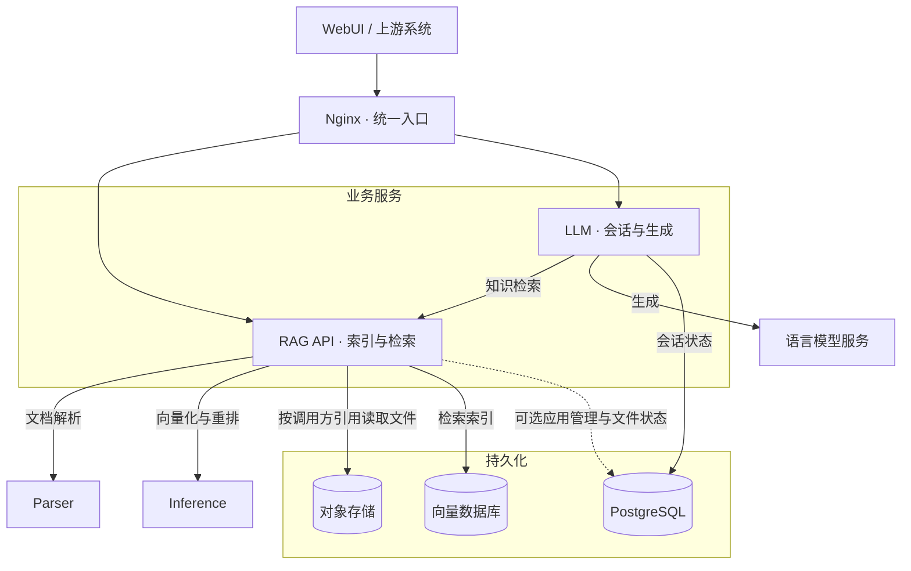
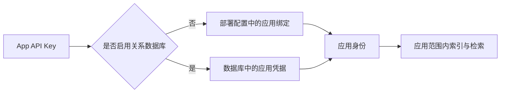
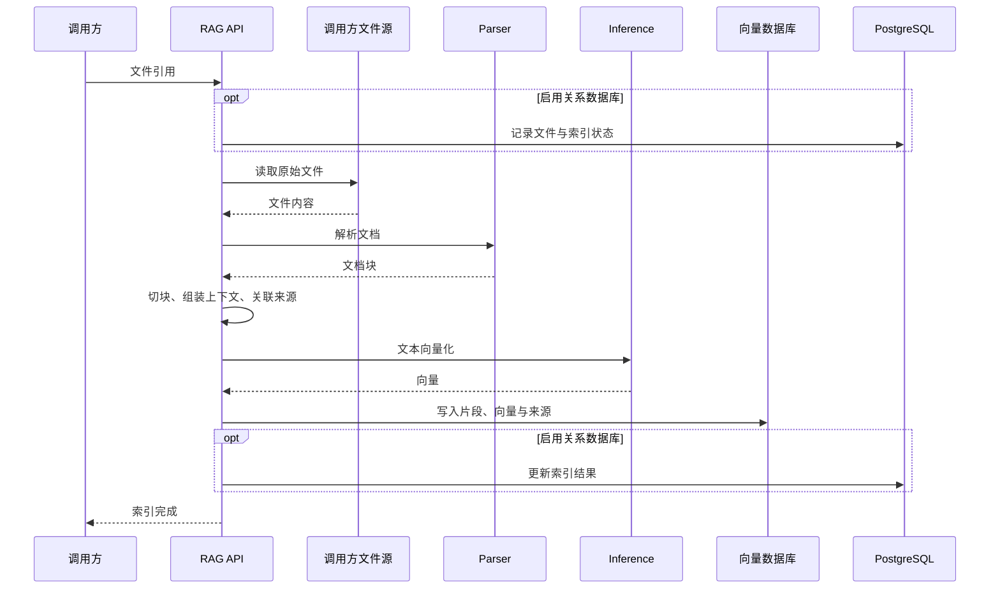
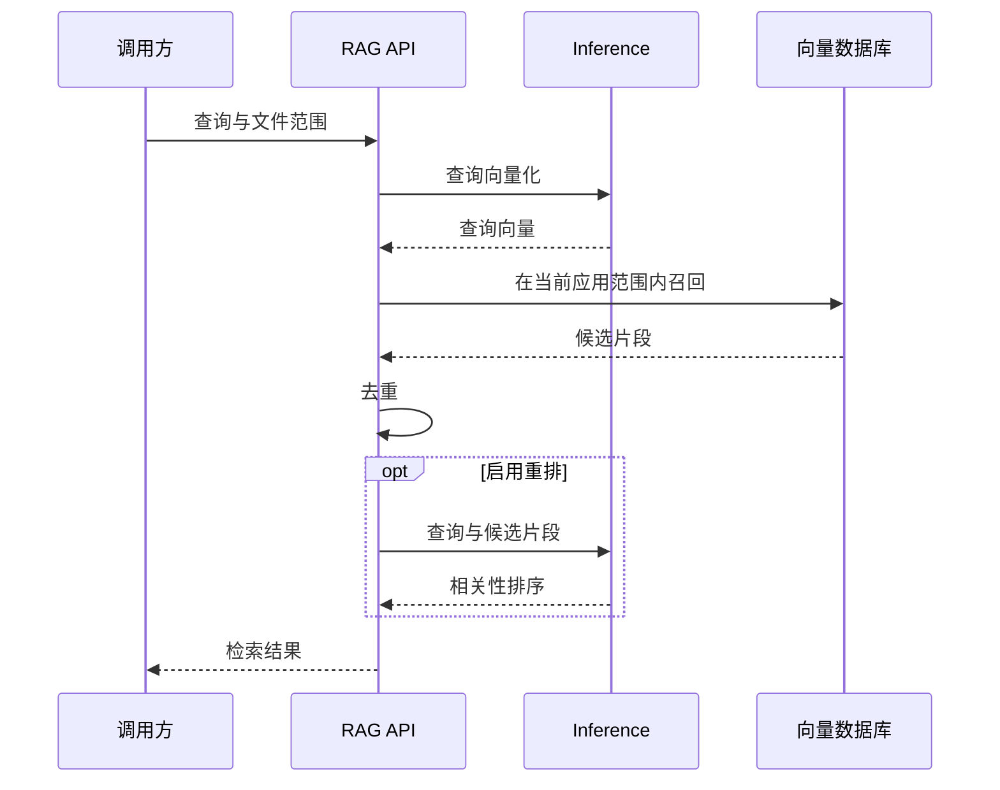
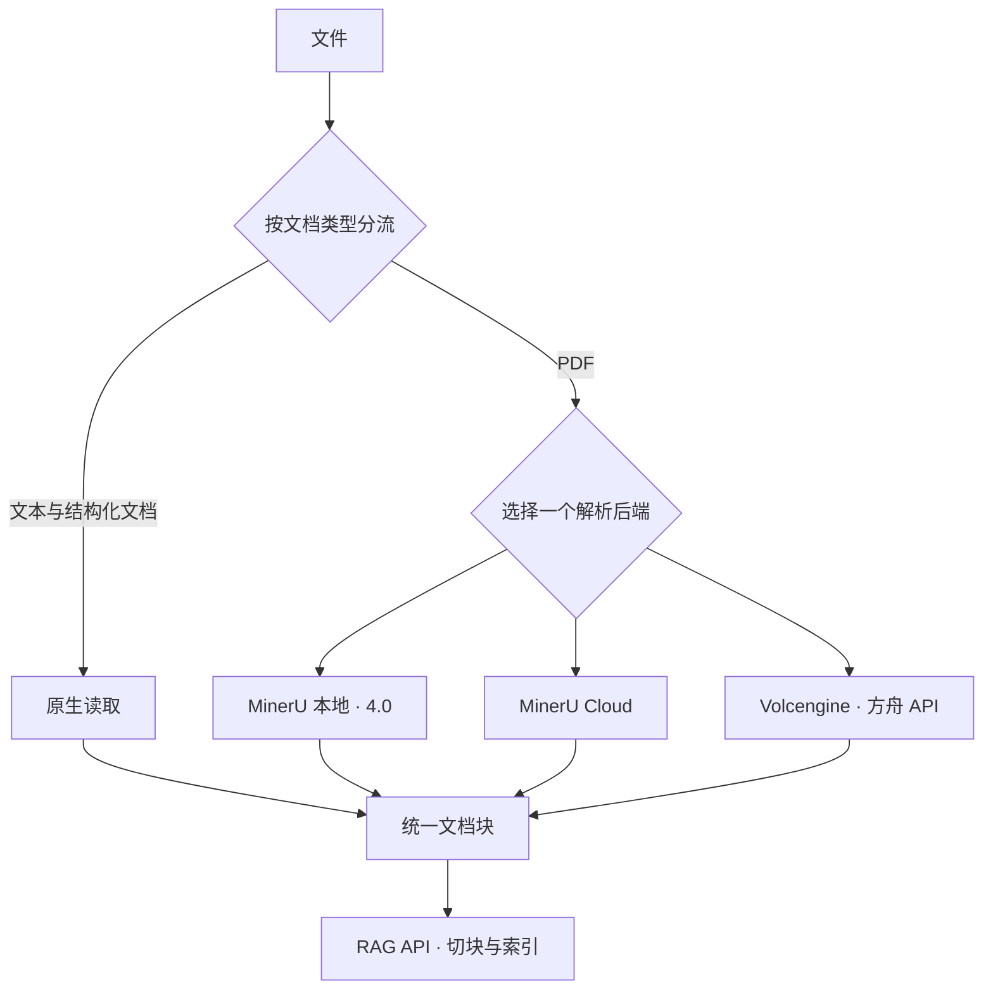
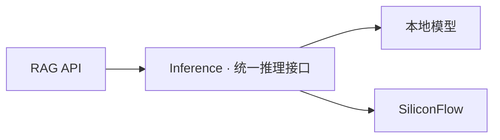
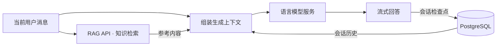

# Brain 项目架构

## 服务关系

## WebUI 与 Nginx

WebUI 提供管理与交互入口，Nginx 托管前端并将请求分发到 RAG API 和 LLM 服务

文档管理与检索进入 RAG API，问答进入 LLM；Parser 和 Inference 由业务服务调用

## RAG API

以应用为数据隔离边界，核心负责鉴权、索引与检索；每个应用对应独立的向量集合。应用管理和文件状态持久化是可选能力

鉴权来源由部署模式决定，数据库故障不回退到配置凭据

### 索引数据流

索引在请求内同步完成，切块策略由 RAG API 管理。正文按段落独立分片，不合并不同段落；单段超长才依次按换行、句子和字符切分。表格仅以标题和完整行数据独立成片，不拼接前后文本。列表、代码和表格保留各自结构边界。直接读取调用方文件引用时，无需自建对象存储

索引链路不做整体重放。Parser、Inference 和 RAG 只在各自拥有的外部调用或写入边界内重试可恢复错误；达到上限后向调用方返回失败，由调用方用同一个 `file_id` 发起业务重试

### 检索数据流

## Parser

负责文件内容提取，通过统一文档块接口向 RAG API 交付解析结果，解析后端的差异保留在服务内部

原生读取是 Parser 内部的公共能力，负责保留段落与表格结构，不生成检索分片。PDF 在本地解析后端与方舟之间选择一个，使用方舟仍运行 Parser 服务，但不加载本地 PDF 模型

## Inference

集中承载检索模型推理，向业务层提供两类独立能力

| 能力 | 输入 | 输出 | 使用阶段 |
| --- | --- | --- | --- |
| 向量化 | 文本 | 稠密向量、可选稀疏向量 | 索引、检索 |
| 重排 | 查询与候选片段 | 相关性排序 | 检索，可选 |

索引与查询必须使用一致的向量模型；重排只处理召回后的候选集

本地模型与外部供应商由 Inference 统一适配，RAG 只依赖服务接口及其能力声明

模型、供应商与计算资源由 Inference 管理，与 RAG API 的业务编排独立部署

## LLM

每轮固定执行知识检索后再生成回答，当前消息用于检索，历史会话与检索结果共同组成生成上下文

## 基础服务

| 服务 | 数据职责 | 访问方 |
| --- | --- | --- |
| PostgreSQL | 应用凭据、文件元数据与索引状态；会话状态 | RAG API、LLM 分别管理各自数据 |
| 对象存储 | 原始文件 | RAG API、上游系统 |
| 向量数据库 | 文档片段、向量与来源信息 | RAG API |
| Loki / Promtail | 日志汇集与查询 | 业务服务与管理台 |

向量数据库通过统一适配接口接入，Qdrant 与 Milvus 选择其一；对象存储采用 S3 兼容接口

各应用服务独立部署，共享持久化服务；跨服务调用传递同一追踪标识，用于关联解析、推理、检索和生成链路
