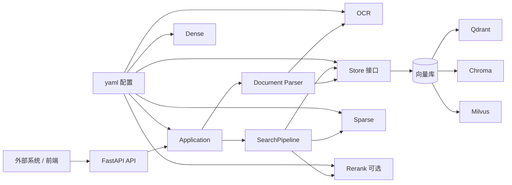
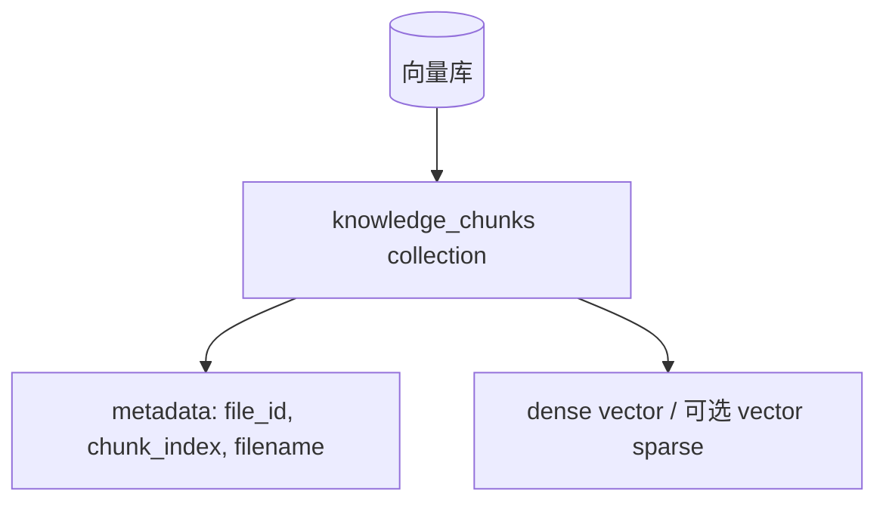
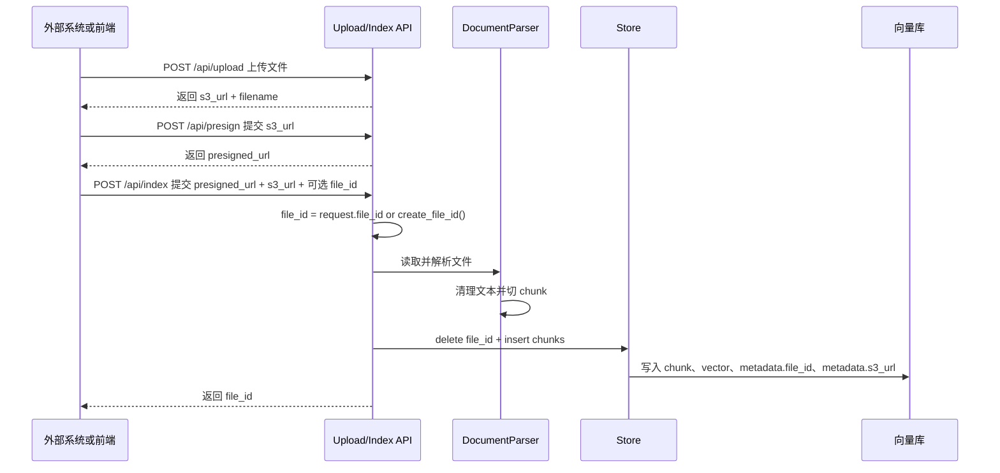
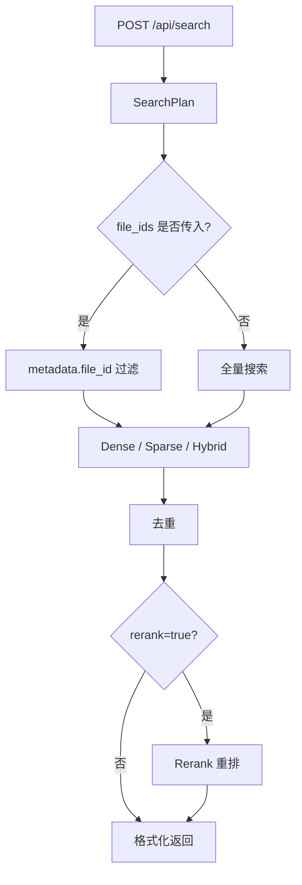

# 知识检索后端架构

本文说明知识检索后端的目标架构。系统以文件为父对象，以 chunk 为检索对象，外部系统通过 `file_id` 限定搜索范围。

架构目标是：向量库、dense 模型、sparse 检索、rerank 模型都可以通过 yaml 配置切换。BGE-M3、Chroma、Milvus 等能力作为可选组件接入，不影响默认的 Qdrant + `bge_base` dense + `bm25` sparse 功能。

---

## 1. 架构目标

- API 保持稳定，调用方不需要知道底层使用哪种向量库或模型。
- 向量库可切换：Qdrant、Chroma、Milvus 等。
- dense 能力可切换：当前支持 `bge-base-zh-v1.5` 和 `bge-m3`。
- sparse 能力可切换：当前支持 `bm25`（`tokenizer=jieba`）、`bge_m3` 和 `milvus_bm25`。`bge_m3` 只用于支持稀疏向量的 store，当前可用于 Qdrant 和 Milvus。
- rerank 能力可切换：当前支持 `bge-reranker-base`、`bge-reranker-large` 和 `bge-reranker-v2-m3`。
- 使用单一 chunks collection 存储所有文档分块。
- 支持通过多个 `file_id` 限定搜索范围。
- 支持 dense、sparse、hybrid 三种检索模式。
- 支持可选 rerank。
- 启动时通过配置文件决定使用哪套组合。
- 代码和配置使用通用命名，不绑定具体业务。

---

## 2. 核心概念

| 概念 | 含义 |
|---|---|
| `file_id` | 文件主键，外部系统保存后用于限定搜索范围 |
| file | 上传或对象存储索引的文件父对象，文件级信息从 chunk metadata 聚合得到 |
| chunk | 文件切片后的检索对象，存储在向量库 collection |
| `top_k` | 最多返回条数 |
| `fetch_k` | rerank 候选池大小，只在 `rerank=true` 时使用 |
| dense | 语义向量检索 |
| sparse | 关键词、词权重或稀疏向量检索 |
| hybrid | dense 和 sparse 的融合检索 |

查询范围示例：

```json
{
  "file_ids": ["upstream-file-001"]
}
```

`file_ids` 不传表示全量搜索；传空数组会被拒绝；一次最多允许 1000 个 `file_id`。

### 2.1 总体架构图



这张图表达的是依赖方向：API 不直接知道具体向量库和模型，搜索流程只依赖 `Store`、`Sparse`、`Rerank` 这些能力接口。具体用 Qdrant、Chroma 还是 Milvus，由 yaml 配置决定。

### LangChain 和原生 SDK 边界

LangChain 在系统里负责文档解析复用、文本切分、HuggingFace embedding 封装、Runnable 搜索编排和 Retriever 生命周期事件。开启 LangSmith 后，可以看到搜索请求在 `prepare_plan`、dense/sparse retriever、fusion、dedupe、rerank、format_response 等阶段的链路。

向量库读写和检索由 Store 层直接使用各向量库原生 SDK：

| 向量库 | Store 实现 | 原生依赖 | 职责 |
|---|---|---|---|
| Qdrant | `store.qdrant.QdrantStore` | `qdrant-client` | collection 创建、payload index、dense/vector sparse 写入与查询 |
| Chroma local | `store.chroma.ChromaStore` | `chromadb` | 本地 collection、metadata filter、dense 写入与查询 |
| Milvus / Milvus Lite | `store.milvus.MilvusStore` | `pymilvus` / `milvus-lite` | schema、dense/sparse index、scalar index、写入与查询 |

这个边界保证搜索流程只依赖 `Store` 接口，不受第三方封装层的底层能力暴露范围影响。新增向量库时，只需要实现 `Store` 接口；如果该向量库支持 vector sparse，再补对应的 `sparse/*` 适配类。

### 2.2 数据库结构图



系统固定使用一个逻辑集合：`knowledge_chunks` 存所有 chunk。不引入 Postgres 文件父表，文件列表从向量库 chunk metadata 聚合得到。`file_id` 写入 chunk metadata，并在支持的向量库里建立过滤索引。

### 2.3 写入流程图



`/api/upload` 返回 `s3_url + filename`。`/api/index` 接收 `presigned_url + s3_url`，`file_id` 和 `filename` 可选；不传 `file_id` 时由 RAG 生成 32 位 hex ID，不传 `filename` 时从 `s3_url` 推导，传了就作为自定义展示文件名。RAG 完成解析、切分、embedding 并写入向量库。对象存储索引接口使用 `presigned_url` 做一次性下载，不把临时下载 URL 写入 chunk metadata；稳定的 `s3_url` 会写入 chunk metadata 用于追溯。

Docker 开发环境使用 MinIO 模拟 S3。MinIO 提供本地 bucket 和对象下载能力，后端提供本地联调用的 `POST /api/presign`：输入 `s3_url`，返回后端可访问的短期下载地址。这个地址是给 `/api/index` 使用的，前端只负责把它转交给后端。生产环境里，重签通常由业务系统或对象存储网关完成，RAG 仍只消费 `presigned_url + s3_url`。

### 2.4 查询流程图



查询只查一个 chunks collection。`file_ids` 作为 metadata filter 缩小候选范围；dense / sparse / hybrid 在同一个范围内检索。hybrid 统一为 dense 和 sparse 两路并发后在应用层做 RRF 融合；开启 rerank 时，再对候选结果做二次排序。

`/api/search` 是公开业务 API，不返回 trace。搜索完成后后端把链路信息写入内存 ring buffer，由内部监控接口暴露给前端诊断面板。trace 描述单次请求的总耗时、结果数和阶段耗时，不做 p50、p95、p99 这类聚合统计。

### 2.5 运行监控

监控是只读能力，不写配置、不触发重启、不切换模型。前端通过 `/api/monitor` 读取当前 ready 状态、组件状态、文件数、chunk 数、collection、索引与存储信息，并通过查询日志读取最近搜索链路。

真正会影响索引结构的配置，例如 store、dense、vector sparse、collection，不允许在前端监控页直接修改。查询级参数，例如 mode、sparse_mode、top_k、fetch_k、dense_weight、sparse_weight、rerank 开关，继续随 `/api/search` 请求传入。

监控页面面向使用者，不展示“索引契约”这类内部术语，也不重复展示服务状态。它只显示：

- 服务状态：后端、向量库、搜索是否可用。
- 组件：Store、Dense、Sparse、Rerank、OCR 的状态和绑定模型。
- 数据：当前文件数、chunk 数。
- 存储位置：当前向量库类型、chunks collection、vector sparse 是否已建立。
- 查询日志：最近若干次搜索的总耗时和各阶段耗时。

组件状态统一为四态：`ready` 表示组件已加载完成，`loading` 表示启用但尚未 ready，`disabled` 表示当前配置未启用，`error` 表示启动或加载失败。Sparse 在前端只作为一个组件展示，当前查询走应用内 BM25 时显示 `bm25（app）`；如果后续切到 vector sparse，再显示对应的 vector sparse 模型。

未来的模型切换操作放在配置页，不放在监控页。

数据库页面展示向量库数据本身。主视图通过 `/api/chunks` 分页列出 chunk 主键、`file_id`、`filename`、`chunk_index` 和完整 chunk 文本；文件聚合列表通过 `/api/files` 从 chunk metadata 汇总得到，只用于查看和删除整份文件的 chunks。

---

## 3. 配置目录

后端使用 `backend/config/` 只保存 yaml 配置文件。配置读取代码放在 `backend/loader.py`，配置结构放在 `backend/schema.py`。

```text
backend/
  config.py
  loader.py
  schema.py
  config/
    local.yaml
    docker-cpu.yaml
    docker-gpu.yaml
    qdrant-bge-base.yaml
    qdrant-bge-m3.yaml
    chroma-bge-base.yaml
    chroma-bge-m3.yaml
    milvus-bge-base.yaml
    milvus-bge-m3.yaml
    milvus-builtin-bm25.yaml
    milvus-lite-bge-base.yaml
    milvus-lite-bge-m3.yaml
    milvus-lite-builtin-bm25.yaml
```

后端通过 `CONFIG_FILE` 指定配置文件。`CONFIG_FILE` 可以写配置文件名，也可以写完整路径。只写文件名时，后端会从 `backend/config/` 读取。未设置 `CONFIG_FILE` 时，后端默认使用 `local.yaml`。

每个运行 profile 使用一个 yaml 文件。yaml 文件固定一种索引结构，不在同一个文件里放多套 dense 或 vector sparse 候选。真正会影响索引结构的组件，例如 dense、vector sparse、collection 名，必须通过切换 profile 或重建索引改变。不会改变索引结构的组件，例如 rerank、ocr，可以继续在同一个 yaml 里用候选项和 `enable` 表达。

每个组件都显式写 `import_path`。组件名负责表达“我要哪种能力”，`import_path` 负责表达“这类能力由哪个 Python 类实现”。这样配置文件里能直接看出实现位置，也方便以后把组件迁移成插件。

`bootstrap.py` 负责应用启动和关闭。`container.py` 负责按配置组装 dense、sparse、store、search、rerank、ocr。它们不保存具体业务规则，也不把某个模型或向量库写死到搜索逻辑里。

配置文件名表达向量库和索引结构，例如 `qdrant-bge-m3.yaml` 表示 Qdrant + BGE-M3 dense + BGE-M3 vector sparse。sparse 的 `app` 必须存在，`vector` 可选；是否允许前端切换 sparse 查询方式由 `/api/config` 根据当前 profile 推导。

---

## 4. 配置结构

基础 profile 示例：

```yaml
dense:
  name: bge_base
  model_name: bge-base-zh-v1.5
  import_path: dense.huggingface.HuggingFaceDense

sparse:
  app:
    type: bm25
    tokenizer: jieba
    import_path: sparse.bm25.BM25Sparse

store:
  type: qdrant
  url: http://localhost:6333
  collections:
    chunks: knowledge_chunks
  import_path: store.qdrant.QdrantStore

search:
  default_mode: hybrid
  top_k: 20
  fetch_k: 50
  dense_weight: 0.5
  sparse_weight: 0.5
  rrf_k: 60

logging:
  level: INFO
  max_bytes: 10485760
  backup_count: 5
  search_trace: true

rerank: null

ocr:
  name: rapid
  model_name: rapidocr
  import_path: ocr.rapid.RapidOCR
```

BGE-M3 配置：

```yaml
dense:
  name: bge_m3
  model_name: bge-m3
  import_path: dense.huggingface.HuggingFaceDense

sparse:
  app:
    type: bm25
    tokenizer: jieba
    import_path: sparse.bm25.BM25Sparse
  vector:
    type: bge_m3
    model_name: bge-m3
    import_path: sparse.qdrant_bge_m3.QdrantBGEM3Sparse

store:
  type: qdrant
  url: http://localhost:6333
  collections:
    chunks: qdrant_bge_m3_knowledge_chunks
  import_path: store.qdrant.QdrantStore

search:
  default_mode: hybrid
  top_k: 20
  fetch_k: 50
  dense_weight: 0.5
  sparse_weight: 0.5
  rrf_k: 60

logging:
  level: INFO
  max_bytes: 10485760
  backup_count: 5
  search_trace: true

rerank:
  name: bge_m3
  model_name: bge-reranker-v2-m3
  import_path: rerank.cross_encoder.CrossEncoderRerank

ocr:
  name: rapid
  model_name: rapidocr
  import_path: ocr.rapid.RapidOCR
```

不同向量库的连接字段不强行统一。统一的是 `store` 暴露给 `search` 的能力。

Qdrant 示例：

```yaml
store:
  type: qdrant
  url: http://localhost:6333
  collections:
    chunks: qdrant_bge_base_knowledge_chunks
  import_path: store.qdrant.QdrantStore
```

Chroma 本地持久化示例：

```yaml
store:
  type: chroma
  persist_dir: chroma_data
  collections:
    chunks: chroma_bge_base_knowledge_chunks
  import_path: store.chroma.ChromaStore
```

Milvus 示例：

```yaml
store:
  type: milvus
  uri: http://localhost:19530
  collections:
    chunks: milvus_bge_base_knowledge_chunks
  import_path: store.milvus.MilvusStore
```

Milvus 评估 profile 按索引结构拆成多个文件：

```text
milvus-bge-base.yaml       -> BGE-base dense + app BM25
milvus-bge-m3.yaml         -> BGE-M3 dense + BGE-M3 vector sparse + app BM25
milvus-builtin-bm25.yaml   -> BGE-base dense + Milvus BM25 vector sparse + app BM25
milvus-lite-bge-base.yaml       -> Milvus Lite + BGE-base dense + app BM25
milvus-lite-bge-m3.yaml         -> Milvus Lite + BGE-M3 dense + BGE-M3 vector sparse + app BM25
milvus-lite-builtin-bm25.yaml   -> Milvus Lite + BGE-base dense + Milvus BM25 vector sparse + app BM25
```

Milvus Standalone 和 Milvus Lite 使用不同 profile，不在同一个 yaml 里通过 `enable` 切 store。`http://localhost:19530` 表示 Milvus Standalone；`milvus_data/lite/*.db` 表示 Milvus Lite。Milvus 的 `bge-m3` 和 `builtin-bm25` profile 都同时配置 `sparse.app` 和 `sparse.vector`：上传会写入 vector sparse，查询时可在 app BM25 和 vector sparse 之间切换。

Milvus 的索引策略按运行形态区分：

- Milvus store 使用 `pymilvus.MilvusClient` 创建 schema、索引、写入和查询。
- Milvus Standalone 的 dense 索引显式使用 `AUTOINDEX`。
- Milvus Lite 的 dense 索引显式使用 `FLAT`。Lite 是嵌入式本地库，本机评测中 HNSW/FAISS 后台建索引会触发进程崩溃；`FLAT` 不做近似索引构建，适合本地开发和小数据量 benchmark。
- Milvus sparse 索引按 sparse 类型选择：`bge_m3` 使用 `SPARSE_INVERTED_INDEX` + `IP`，`milvus_bm25` 使用 `SPARSE_INVERTED_INDEX` + `BM25`。
- `file_id` 是过滤字段，创建 collection 时会额外建 scalar index。

---

## 5. 模块目录

目标目录结构：

```text
backend/
  main.py
  bootstrap.py
  container.py
  config.py
  device.py
  document_parser.py
  download_models.py
  loader.py
  schema.py

  config/
    local.yaml
    docker-cpu.yaml
    docker-gpu.yaml
    qdrant-bge-base.yaml
    qdrant-bge-m3.yaml
    chroma-bge-base.yaml
    chroma-bge-m3.yaml
    milvus-bge-base.yaml
    milvus-bge-m3.yaml
    milvus-builtin-bm25.yaml
    milvus-lite-bge-base.yaml
    milvus-lite-bge-m3.yaml
    milvus-lite-builtin-bm25.yaml

  dense/
    base.py
    huggingface.py

  sparse/
    base.py
    bm25.py
    bge_m3_common.py
    qdrant_bge_m3.py
    milvus_bge_m3.py
    milvus_bm25.py

  store/
    base.py
    qdrant.py
    chroma.py
    milvus.py

  search/
    base.py
    pipeline.py
    runner.py

  rerank/
    base.py
    cross_encoder.py

  ocr/
    base.py
    rapid.py
    paddle.py
    tesseract.py

  tokenizer/
    base.py
    jieba_tokenizer.py
```

模块职责：

| 模块 | 职责 |
|---|---|
| `main.py` | FastAPI 应用、上传、搜索、删除、列表、配置端点 |
| `bootstrap.py` | 创建 Application，管理组件启动和关闭 |
| `container.py` | DI 容器，按配置组装组件并注入依赖 |
| `config.py` | 应用配置入口，暴露搜索参数、模型路径、向量库配置 |
| `device.py` | 检测当前可用计算设备；有 GPU 时优先使用 GPU，否则使用 CPU |
| `download_models.py` | 下载或准备本地模型目录 |
| `loader.py` | 读取 `CONFIG_FILE` 指定的 yaml；未设置时读取 `local.yaml` |
| `schema.py` | 校验配置结构和默认值 |
| `document_parser.py` | 文件解析、OCR 调用、文本清理、chunk 生成 |
| `dense/` | 生成 dense 向量 |
| `sparse/` | 执行应用内 sparse 检索，或生成 sparse vector |
| `store/` | 连接向量库，负责写入、删除、列表、dense 查询、可选 sparse 查询 |
| `search/` | SearchPipeline 和 SearchRunner，负责检索流程、并发查询、去重、融合和 rerank 调用 |
| `rerank/` | 对候选结果做二次排序 |
| `ocr/` | 图片或 PDF 内图片的 OCR |
| `tokenizer/` | 分词能力接口和 jieba 实现 |

命名规则：

- `dense/` 只负责 dense vector。
- dense 能力接口命名为 `Dense`。
- 当前 HuggingFace dense 实现命名为 `HuggingFaceDense`。
- dense 模型通过 yaml 的 `model_name` 指定，启动时解析到 `models/` 下的实际路径。
- BGE-M3 的模型加载和 lexical weights 归一化放在 `sparse/bge_m3_common.py`。
- BGE-M3 的 sparse 向量库适配按向量库拆开，例如 `sparse/qdrant_bge_m3.py`、`sparse/milvus_bge_m3.py`，不放在 `dense/` 里。

---

## 6. 组件组装

启动目标流程：

```text
1. 读取 CONFIG_FILE，未设置时使用 local.yaml
2. 解析 yaml
3. 校验配置
4. 创建 DI 容器
5. 容器按配置创建 dense、sparse、store、search、rerank、ocr
6. FastAPI 进程启动
7. 后台初始化线程按顺序启动 Application 组件
8. 初始化成功后 application.ready=true
```

示意代码：

```python
config = load_app_config()
container = create_container(config)

dense = container.dense()
app_sparse = container.app_sparse()
vector_sparse = container.vector_sparse()
store = container.store(dense=dense, sparse=vector_sparse)
search = container.search(store=store, app_sparse=app_sparse, vector_sparse=vector_sparse)
rerank = container.rerank()
ocr = container.ocr()
```

`container.py` 使用 DI 容器组装组件。配置里的组件名映射到容器 provider，provider 负责创建具体实现和注入依赖。例如 `sparse.app.type=bm25` 与 `tokenizer=jieba` 会组装成 `BM25Sparse(tokenizer=JiebaTokenizer())`。`bootstrap.py` 只管理 Application 生命周期。FastAPI 启动后由后台线程初始化 Application；如果数据库暂时不可用，后端进程不退出，后台线程按退避间隔继续重试。搜索流程只依赖组件能力，不直接依赖具体实现类。

`Application.start()` 是唯一的组件启动入口，按固定顺序启动：dense、sparse、vector_sparse、store、search、rerank、ocr。其中 `vector_sparse` 和 `rerank` 只有在当前配置启用时才启动。`Application.stop()` 按反向顺序停止组件。

Store 和 Search 不负责偷偷启动 dense、sparse 或 vector_sparse，只校验依赖组件已经 ready。这样初始化和查询严格分离：模型只在启动阶段加载，查询阶段不会懒加载模型。启动某个组件失败时，`Application` 会记录对应的 `component_errors`，`/api/monitor` 根据错误把组件状态标成 `error`，前端用红色展示。

---

## 7. Store 能力

`store/base.py` 定义搜索流程需要的统一能力。不同向量库的连接方式可以不同，但对 `search` 暴露的方法保持一致。

目标能力：

```python
class Store:
    def start(self) -> None: ...
    def stop(self) -> None: ...

    def add_file_chunks(self, chunks: list[dict], file_id: str) -> int: ...
    def delete_file_chunks(self, file_id: str) -> int: ...

    def get_total_chunks(self, file_ids: list[str] | None = None) -> int: ...
    def get_search_documents(self, metadata_filter: object) -> list[dict]: ...
    def build_file_filter(self, file_ids: list[str] | None = None): ...
    def search_dense(self, query: str, limit: int, metadata_filter: object) -> list[dict]: ...
    def search_sparse(self, query: str, limit: int, metadata_filter: object) -> list[dict]: ...
    def search_hybrid(
        self,
        query: str,
        limit: int,
        metadata_filter: object,
        dense_weight: float,
        sparse_weight: float,
        rrf_k: int,
    ) -> list[dict]: ...
    def sparse_uses_store(self, sparse: object | None = None) -> bool: ...
```

`SearchPipeline` 只依赖 `Store` 接口，不直接依赖 `store.qdrant`、`store.chroma`、全局 store 模块函数或向量库 SDK。各 Store 实现内部使用原生 SDK 完成 collection、索引、写入、删除、列表和查询。`bm25` sparse 使用 `get_search_documents()` 取文本，再交给 `sparse/bm25.py` 排序；`bge_m3` sparse 只用于支持稀疏向量的 store，由对应向量库执行 sparse 查询。

写入规则：

- 每个文件使用 `file_id` 替换范围。
- 同一 `file_id` 写入前先删除旧 chunks，再插入新 chunks。
- `file_id`、`chunk_index`、`filename` 必须写入 chunk metadata。
- 不同 `file_id` 的写入可以并发。
- 读操作可以并发。

---

## 8. Sparse 能力

`sparse` 配置分成能力声明和查询选择。`sparse.app` 必须存在，当前是应用内 `bm25` + `jieba`；`sparse.vector` 可选，表示上传时会写入向量库 sparse vector 或向量库内置 sparse 索引。搜索流程里统一表现为 Sparse Retriever，但内部有两种路线：

```text
应用内 Sparse Retriever
  -> 先从 store 取候选文本
  -> 应用内 `bm25` sparse 使用 `tokenizer=jieba` 打分
  -> 适用于 sparse_mode=app

Vector Sparse Retriever
  -> 查询向量库 sparse vector / 内置 sparse 能力
  -> 适用于 sparse_mode=vector
```

这两种都属于检索节点，都会放在 SearchPipeline 的 Retriever 位置；区别只是 sparse 分数在哪里计算。
benchmark 报告中的 `sparse_impl` 使用 `app` 和 `vector` 区分这两条路线。

`/api/config` 返回当前 profile 支持的 sparse 查询方式：

```json
{
  "sparse": {
    "default_mode": "app",
    "available_modes": ["app", "vector"]
  }
}
```

`/api/search` 可以传 `sparse_mode`。不传时默认 `app`；传 `vector` 时，当前 profile 必须配置 `sparse.vector`，否则返回 400。前端只展示 `available_modes` 里的选项。

`bm25` sparse：

```yaml
sparse:
  app:
    type: bm25
    tokenizer: jieba
```

流程：

```text
1. store 按 file_ids 过滤后取候选文本
2. sparse 在应用内分词和打分
3. 返回排序后的结果
```

当前实现使用 `bm25` sparse + `tokenizer=jieba`：

```text
1. jieba 对查询和候选文本分词
2. 去掉纯标点和单个汉字这类不稳定命中项
3. BM25 对候选文本打分排序
4. 不返回零命中文本
```

应用内 `bm25` sparse 直接使用 `rank_bm25` 计算分数，不使用 LangChain `BM25Retriever.invoke()`。原因是 `BM25Retriever.invoke()` 只返回 `Document` 列表，不直接返回 BM25 分数；搜索流程需要分数做过滤、排序和 hybrid 融合。

向量库检索和应用内 BM25 的 score 来源不同：

```text
dense 检索
  -> 使用各向量库 store 的原生查询接口
  -> score 来自向量库

vector sparse
  -> 使用向量库 sparse 查询
  -> score 来自向量库

应用内 bm25 sparse
  -> 使用 rank_bm25 在应用进程里计算
  -> score 来自 BM25 关键词打分
```

BGE-M3 vector sparse：

```yaml
sparse:
  app:
    type: bm25
    tokenizer: jieba
  vector:
    type: bge_m3
```

流程：

```text
1. 上传时 sparse 生成 sparse vector
2. store 把 sparse vector 写入向量库
3. 查询时 sparse 生成 query sparse vector
4. store 执行 sparse vector 查询
```

`milvus_bm25` sparse：

```yaml
sparse:
  app:
    type: bm25
    tokenizer: jieba
  vector:
    type: milvus_bm25
```

流程：

```text
1. 上传时 `milvus_bm25` sparse 按 Milvus analyzer 从文本生成 BM25 sparse vector
2. 查询时 Milvus 对查询文本执行同一套 analyzer
3. sparse 由 Milvus 执行；hybrid 仍由 SearchPipeline 对 dense 和 sparse 结果做应用层融合
```

当前 `milvus_bm25` 使用 Milvus analyzer 的 `jieba` tokenizer，便于中文评估。它和应用内 `bm25` sparse 是两条不同路线，配置文件分开。

这个设计可以兼容：

```text
Qdrant + `bm25` sparse
Qdrant + `bge_m3` sparse
Chroma + `bm25` sparse
Chroma + `bge_m3` dense + `bm25` sparse
Milvus + `bm25` sparse
Milvus + `bge_m3` dense + `bm25` sparse
Milvus + `bge_m3` sparse
Milvus + `milvus_bm25` sparse
```

---

## 9. 知识集合

系统逻辑上始终使用一个知识集合：

| 集合 | 用途 |
|---|---|
| chunks | 存储所有文件 chunk |

具体 collection 名由 yaml 决定。当前默认 collection 是 `knowledge_chunks`。文件范围通过 `file_id` metadata filter 表达；系统只有这一套 chunks collection。不同模型组合如果索引结构不兼容，必须使用不同 profile 或重建 collection，避免新旧向量混在一个索引里。

---

## 10. Payload Metadata

每条 chunk 在向量库里分成三类数据：

| 类型 | 存什么 | 例子 |
|---|---|---|
| 正文内容 | 被检索、展示的 chunk 文本 | `content` / `documents` / `text` |
| metadata | 描述这段正文的附加信息 | `file_id`、`filename`、`chunk_index`、`s3_url` |
| vector | 正文内容生成出来的向量 | dense vector、可选 sparse vector |

chunk metadata：

```json
{
  "file_id": "upstream-file-001",
  "filename": "faq.pdf",
  "chunk_index": 0,
  "s3_url": "s3://bucket/path/to/faq.pdf"
}
```

字段约定：

| 字段 | 类型 | 说明 |
|---|---|---|
| `file_id` | keyword/string | 必填，搜索过滤用，要建索引 |
| `filename` | keyword/string | 必填，搜索结果展示用 |
| `chunk_index` | integer | 必填，文件内 chunk 序号，不建索引 |
| `s3_url` | string | 对象存储来源地址，用于追溯，不建索引 |

放进 metadata 不等于自动有高效过滤索引。只给 `file_id` 建过滤索引：

| 向量库 | `file_id` 过滤索引策略 |
|---|---|
| Qdrant | 创建 payload index：`metadata.file_id` |
| Milvus | 创建 scalar index：`file_id` 字段 |
| Chroma local | metadata 写入后由 Chroma 本地 SQLite metadata 表维护索引；代码不额外声明索引 |

`filename`、`chunk_index` 会随每条 chunk 一起保存，搜索结果可以返回这些字段；它们不作为搜索过滤条件，不建索引。

chunk 文本会随分块一起写入向量库。不同向量库的原生字段不同，但 Store 对搜索流程统一返回 `content`：

| 向量库 | 原生保存位置 | Store 返回字段 |
|---|---|---|
| Qdrant | payload 的 `content` | `content` |
| Chroma local | Chroma collection 的 `documents` | `content` |
| Milvus / Milvus Lite | scalar 字段 `text` | `content` |

向量库里保存的是解析后的 chunk 文本，不保存完整原始文件内容。上传接口把原文件写入对象存储；对象存储索引接口不保存 `presigned_url`。

---

## 11. 文档解析与切片

上传文件先解析成纯文本，再切成 chunk 写入 store。

当前切片规则：

| 参数 | 值 |
|---|---|
| chunk size | 250 |
| overlap | 50 |

切片按中文文档常见边界拆分，优先使用段落、换行、中文句号、感叹号、问号、分号、逗号和空格。

解析后的文本会做 Unicode 归一化，并去掉中文字符之间由 PDF 提取产生的多余空格。

---

## 12. 搜索计划

`SearchPlan` 描述一次搜索：

```python
SearchPlan(
    query="查询内容",
    mode="hybrid",
    top_k=20,
    rerank=False,
    fetch_k=50,
    dense_weight=0.5,
    sparse_weight=0.5,
    rrf_k=60,
    file_ids=["upstream-file-001"],
    sparse_mode="app",
)
```

字段说明：

| 字段 | 说明 |
|---|---|
| `query` | 查询文本 |
| `mode` | `dense` / `sparse` / `hybrid` |
| `top_k` | 最多返回条数 |
| `rerank` | 是否使用 rerank |
| `fetch_k` | rerank 候选池大小 |
| `dense_weight` | 本次 hybrid 查询的 dense 权重 |
| `sparse_weight` | 本次 hybrid 查询的 sparse 权重 |
| `rrf_k` | 本次 hybrid 查询的 RRF 参数 |
| `file_ids` | 查询文件范围；不传表示全量搜索 |
| `sparse_mode` | sparse 查询方式，`app` / `vector` |

---

## 13. 搜索执行

检索阶段数量：

```text
rerank=false -> retrieve_limit = top_k
rerank=true  -> retrieve_limit = fetch_k
```

执行流程：

```text
1. 检查 application 已 ready
2. SearchPlan 进入 SearchPipeline Runnable
3. prepare_plan 计算 retrieve_limit
4. retrieve 按 file_ids 构造的 metadata_filter 查询 chunks collection
5. hybrid 时 dense / sparse 使用 RunnableParallel 并发查询
6. fusion 对 dense / sparse 结果做加权倒数排名融合
7. dedupe 按 chunk id 去重
8. rerank=true 时，对合并候选执行 rerank
9. format_response 最多返回 top_k 条
```

Runnable 结构：

```text
SearchPipeline RunnableSequence
  prepare_plan
  retrieve
    dense/sparse Retriever RunnableParallel
    fusion
  dedupe
  rerank
  format_response
```

dense 和 sparse 检索节点使用 LangChain `BaseRetriever`。这些节点会触发 LangChain retriever 生命周期事件，开启 LangSmith 后会显示为 retriever run。`prepare_plan`、`fusion`、`dedupe`、`rerank`、`format_response` 不是检索动作，继续使用普通 Runnable 阶段。

三种检索模式：

```text
dense  -> Dense Retriever 调用 Store.search_dense()，由具体 store 实现 dense 查询
sparse -> 应用内 Sparse Retriever 执行 BM25，或 Vector Sparse Retriever 调用向量库 sparse 查询
hybrid -> dense + sparse 并发后应用层 RRF 融合；sparse 可以是应用内 BM25，也可以是向量库 sparse
```

并发规则：

- hybrid 内部 dense 和 sparse 可以并发查询。
- rerank 在候选合并去重后执行。

排序规则：

- dense 按向量库返回的 dense 相似度排序。
- sparse 按 sparse 自身分数排序。
- hybrid 按加权倒数排名融合排序。
- rerank 开启时，最终顺序由 rerank 决定。

`top_k` 是最多返回条数，不是必须填满。sparse 不补满，查不到就可以返回空；dense 和 hybrid 如果不做额外相关性判断，本质上都是 top_k 排序，在库里有足够文档时可能返回到 `top_k` 条，不保证结果真的相关。

`rrf_k` 是 hybrid 的 RRF 融合参数，当前代码在 `search/pipeline.py` 中使用它计算 dense/sparse 融合分。它不是返回条数，也不是候选池大小。

---

## 14. 日志

日志配置跟随业务 yaml：

```yaml
logging:
  level: INFO
  max_bytes: 10485760
  backup_count: 5
  search_trace: true
```

默认只输出到 stdout，不写本地文件。如果配置 `file`，则同时写 stdout 和本地滚动文件：

```yaml
logging:
  level: INFO
  file: logs/rag.jsonl
  max_bytes: 10485760
  backup_count: 5
  search_trace: true
```

日志格式统一是 JSONL，一行一条 JSON。普通应用日志和搜索链路日志使用同一个格式，通过 `logger` 和 `event` 区分：

```json
{"logger":"rag.app","event":"startup_ready","message":"Startup model preload done"}
{"logger":"rag.trace","event":"search_trace","query":"查询内容","mode":"hybrid","elapsed_ms":123.4}
```

`rag.app` 记录启动、关闭、模型加载、OCR 加载、上传、删除、异常等应用事件。`rag.trace` 记录一次搜索的链路信息，包括查询参数、总耗时、结果数量和阶段耗时。`search_trace: false` 时不输出搜索链路日志。

Docker 模式下，应用仍输出 JSONL 到 stdout。Docker Compose 使用 `json-file` driver 按大小滚动容器日志，避免日志无限增长。

LangSmith 和本地 JSONL 日志可以同时开启。LangSmith 用于查看 LangChain Runnable / Retriever 的可视化链路；JSONL 日志是本地和生产环境都能保留的基础日志。

---

## 15. BGE-M3 扩展

`bge-m3` 作为新增配置组合接入，不替换 `bge-base-zh-v1.5` 组合。

当前组合：

```text
dense  -> bge-base-zh-v1.5
sparse -> bm25 + tokenizer=jieba
store  -> Qdrant dense vector
rerank -> 可选；CPU 默认不启用
```

`bge-m3` 相关组合：

```text
dense  -> bge-m3 dense vector，仍通过 LangChain HuggingFaceEmbeddings 执行
sparse -> bm25 时走应用内检索；bge_m3 时走向量库 sparse vector
store  -> Qdrant 或 Milvus 使用 bge_m3 vector sparse 时会同时保存 sparse vector；Chroma 当前只使用 dense vector + 应用内 bm25
rerank -> bge-reranker-v2-m3
```

相关文件：

```text
sparse/qdrant_bge_m3.py
sparse/bge_m3_common.py
sparse/milvus_bge_m3.py
schema.py
bootstrap.py
container.py
store/qdrant.py
store/chroma.py
store/milvus.py
search/pipeline.py
backend/config/qdrant-bge-base.yaml
backend/config/qdrant-bge-m3.yaml
backend/config/chroma-bge-base.yaml
backend/config/chroma-bge-m3.yaml
backend/config/milvus-bge-base.yaml
backend/config/milvus-bge-m3.yaml
backend/config/milvus-builtin-bm25.yaml
backend/config/milvus-lite-bge-base.yaml
backend/config/milvus-lite-bge-m3.yaml
backend/config/milvus-lite-builtin-bm25.yaml
backend/config/local.yaml
backend/config/docker-cpu.yaml
backend/config/docker-gpu.yaml
```

索引规则：

- `bge-m3` 和 `bge-base-zh-v1.5` 不能混用同一个已有索引；切换配置后需要重新上传、重建索引，或改用另一组 collection 名。
- 不在同一个 collection 里混用不同 dense 向量维度。
- 不在旧 dense-only collection 里直接写入 BGE-M3 vector sparse。
- 代码不会在启动时阻止使用已有 collection；切换模型、sparse 类型或向量库结构后，由配置和 collection 名约定保证索引不混用。
- 测试用例使用测试 collection 或临时目录，不复用生产 collection。

---

## 16. 部署

后端启动只依赖一个配置入口：

```text
CONFIG_FILE=/path/to/config.yaml
```

生产环境要求：

- 向量库使用独立持久化存储。
- 模型文件保存在固定路径。
- 配置文件由部署环境指定。
- `/api/health` 表示后端进程存活；`/api/ready` 表示 RAG 组件和向量库已初始化完成。
- 该设计对应 Kubernetes 的 liveness/readiness 模式：`/api/health` 可作为 liveness probe，`/api/ready` 可作为 readiness probe。
- RAG 未 ready 时，上传、查询、文档列表、scope 列表等业务接口返回 503；后台初始化成功后自动恢复。
- LangSmith tracing 由部署环境通过 `LANGSMITH_TRACING`、`LANGSMITH_API_KEY`、`LANGSMITH_PROJECT` 控制，不写入 yaml。
- 不同检索组合使用不同 collection 或 index。
- Qdrant、Chroma、Milvus 等具体服务按各自方式部署。Milvus Standalone 使用 `--profile milvus` 启动；Milvus Lite 不需要 Docker 服务，只需要把 `uri` 指向本地 `.db` 文件。
- 同名文件替换使用 document key 细粒度锁或按 document key 分区的写入队列。
- 向量库数据目录需要独立备份。

Docker 开发模式分 CPU 和 GPU 两套 compose。CPU 配置位于 `deploy/cpu/docker-compose.yml`，默认使用 `docker-cpu.yaml`；GPU 配置位于 `deploy/gpu/docker-compose.yml`，默认使用 `docker-gpu.yaml`。代码目录挂载进容器，`uvicorn --reload` 会在代码变更后自动重启。前端使用 Vite dev server，代码目录挂载进容器，支持热更新。

GPU Docker 配置在 `deploy/gpu/docker-compose.yml`，GPU 声明使用 Docker Compose 官方推荐的 device reservation 写法：

```yaml
deploy:
  resources:
    reservations:
      devices:
        - driver: nvidia
          count: all
          capabilities: [gpu]
```

本地数据目录按数据库产品分组：

```text
qdrant_data/

chroma_data/

milvus_data/
  standalone/
    etcd/
    minio/
    milvus/
  lite/
    lite.db
```

Qdrant 和 Milvus Standalone 是服务型数据库，backend 通过网络访问。Chroma local 和 Milvus Lite 是嵌入式文件库，本地后端和 Docker 后端使用同一份数据目录；不要同时启动两个后端访问同一份嵌入式库文件。
