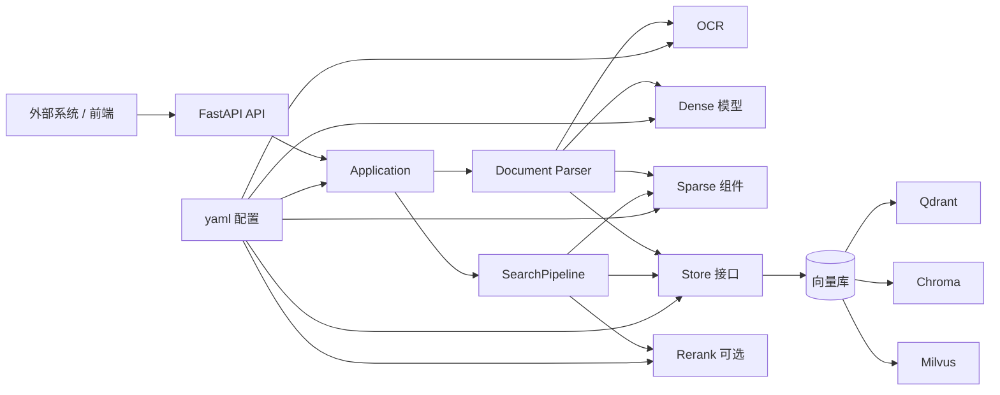
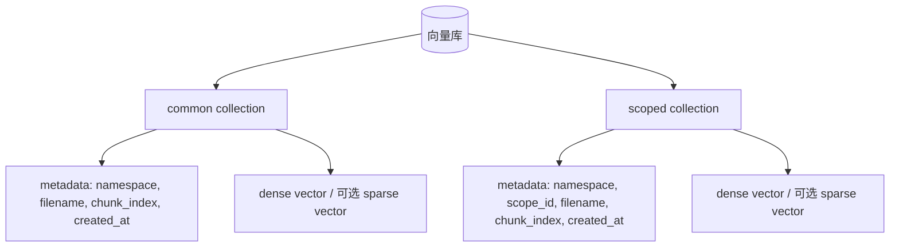
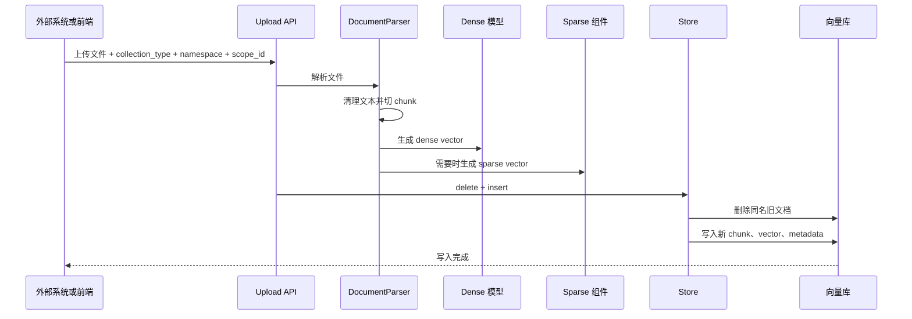
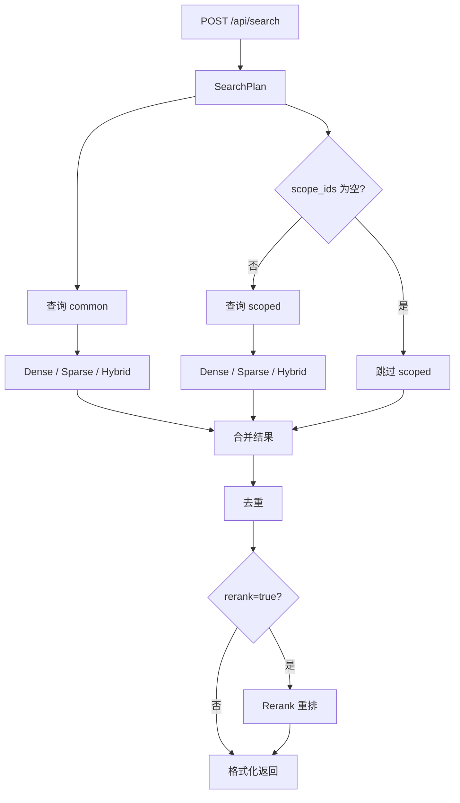

# 知识检索后端架构

本文说明知识检索后端的目标架构。系统支持通用知识和范围专属知识，适用于多系统、多区域、多部门、多项目等知识问答场景。

架构目标是：向量库、dense 模型、sparse 检索、rerank 模型都可以通过 yaml 配置切换。BGE-M3、Chroma、Milvus 等能力作为可选组件接入，不影响默认的 Qdrant + `bge_base` dense + `bm25` sparse 功能。

---

## 1. 架构目标

- API 保持稳定，调用方不需要知道底层使用哪种向量库或模型。
- 向量库可切换：Qdrant、Chroma、Milvus 等。
- dense 能力可切换：当前支持 `bge-base-zh-v1.5` 和 `bge-m3`。
- sparse 能力可切换：当前支持 `bm25`（`tokenizer=jieba`）、`bge_m3` 和 `milvus_bm25`。`bge_m3` 只用于支持稀疏向量的 store，当前可用于 Qdrant 和 Milvus。
- rerank 能力可切换：当前支持 `bge-reranker-base`、`bge-reranker-large` 和 `bge-reranker-v2-m3`。
- 使用两个知识集合隔离通用知识和范围专属知识。
- 支持 `namespace` 隔离不同系统或租户。
- 支持通过多个 `scope_id` 查询范围专属知识。
- 支持 dense、sparse、hybrid 三种检索模式。
- 支持可选 rerank。
- 启动时通过配置文件决定使用哪套组合。
- 代码和配置使用通用命名，不绑定具体业务。

---

## 2. 核心概念

| 概念 | 含义 |
|---|---|
| `namespace` | 系统命名空间，用于隔离不同系统或租户 |
| `scope_id` | 命名空间内的范围标识，例如某个区域、部门、项目 |
| common knowledge | 通用知识，适用于整个 `namespace` |
| scoped knowledge | 范围专属知识，只适用于指定 `scope_id` |
| `top_k` | 最多返回条数 |
| `fetch_k` | rerank 候选池大小，只在 `rerank=true` 时使用 |
| dense | 语义向量检索 |
| sparse | 关键词、词权重或稀疏向量检索 |
| hybrid | dense 和 sparse 的融合检索 |

查询范围示例：

```json
{
  "namespace": "default",
  "scope_ids": ["scope_001", "scope_002"]
}
```

搜索时始终查询 common knowledge。如果请求带 `scope_ids`，系统同时查询 scoped knowledge。两路结果合并后统一排序。

### 2.1 总体架构图



这张图表达的是依赖方向：API 不直接知道具体向量库和模型，搜索流程只依赖 `Store`、`Sparse`、`Rerank` 这些能力接口。具体用 Qdrant、Chroma 还是 Milvus，由 yaml 配置决定。

### 2.2 数据库结构图



系统固定使用两个逻辑集合：`common` 存通用知识，`scoped` 存范围专属知识。`namespace` 用来隔离不同外部系统；`scope_id` 只出现在 scoped 集合里，用来限定范围专属知识。

### 2.3 写入流程图



写入时同名文件使用 `delete + insert` 替换。common 的替换范围是 `namespace + filename`；scoped 的替换范围是 `namespace + scope_id + filename`。

### 2.4 查询流程图



查询时始终查 common。如果传入 `scope_ids`，再并行查询 scoped。common 和 scoped 的结果不是简单拼接，而是合并、去重后统一排序；开启 rerank 时，再对候选结果做二次排序。

---

## 3. 配置目录

后端使用 `backend/config/` 只保存 yaml 配置文件。配置读取代码放在 `backend/loader.py`，配置结构放在 `backend/schema.py`。

```text
backend/
  config.py
  loader.py
  schema.py
  config/
    local.yaml
    docker-cpu.yaml
    docker-gpu.yaml
    qdrant.yaml
    chroma.yaml
    milvus.yaml
```

后端通过 `CONFIG_FILE` 指定配置文件。`CONFIG_FILE` 可以写配置文件名，也可以写完整路径。只写文件名时，后端会从 `backend/config/` 读取。未设置 `CONFIG_FILE` 时，后端默认使用 `local.yaml`。

每个运行 profile 使用一个 yaml 文件。yaml 内部用 `enable: true` 选择 dense、sparse、store、ocr 的具体组件，这些组件必须各启用一个。rerank 是可选组件，可以不启用；启用时同样只能启用一个。

每个可启用组件都显式写 `import_path`。组件名负责表达“我要哪种能力”，`import_path` 负责表达“这类能力由哪个 Python 类实现”。这样配置文件里能直接看出实现位置，也方便以后把组件迁移成插件。

`bootstrap.py` 负责应用启动和关闭。`container.py` 负责按配置组装 dense、sparse、store、search、rerank、ocr。它们不保存具体业务规则，也不把某个模型或向量库写死到搜索逻辑里。

配置文件名只表示向量库类型。具体使用哪个 dense、sparse、rerank、ocr，由 yaml 内对应组件的 `enable` 决定。

---

## 4. 配置结构

当前稳定配置：

```yaml
dense:
  bge_base:
    enable: true
    model_name: bge-base-zh-v1.5
    import_path: dense.huggingface.HuggingFaceDense
  bge_m3:
    enable: false
    model_name: bge-m3
    import_path: dense.huggingface.HuggingFaceDense

sparse:
  bm25:
    enable: true
    tokenizer: jieba
    import_path: sparse.bm25.BM25Sparse
  bge_m3:
    enable: false
    model_name: bge-m3
    import_path: sparse.qdrant_bge_m3.QdrantBGEM3Sparse

store:
  qdrant:
    enable: true
    url: http://localhost:6333
    collections:
      common: knowledge_common
      scoped: knowledge_scoped
    import_path: store.qdrant.QdrantStore

search:
  default_mode: hybrid
  top_k: 20
  fetch_k: 50
  dense_weight: 0.5
  sparse_weight: 0.5
  rrf_k: 60

logging:
  level: INFO
  max_bytes: 10485760
  backup_count: 5
  search_trace: true

rerank:
  bge_base:
    enable: true
    model_name: bge-reranker-base
    import_path: rerank.cross_encoder.CrossEncoderRerank
  bge_large:
    enable: false
    model_name: bge-reranker-large
    import_path: rerank.cross_encoder.CrossEncoderRerank
  bge_m3:
    enable: false
    model_name: bge-reranker-v2-m3
    import_path: rerank.cross_encoder.CrossEncoderRerank

ocr:
  rapid:
    enable: true
    model_name: rapidocr
    import_path: ocr.rapid.RapidOCR
  paddle:
    enable: false
    model_name: paddleocr
    import_path: ocr.paddle.PaddleOCR
  tesseract:
    enable: false
    model_name: tesseract
    import_path: ocr.tesseract.TesseractOCR
```

BGE-M3 配置：

```yaml
dense:
  bge_base:
    enable: false
    model_name: bge-base-zh-v1.5
    import_path: dense.huggingface.HuggingFaceDense
  bge_m3:
    enable: true
    model_name: bge-m3
    import_path: dense.huggingface.HuggingFaceDense

sparse:
  bm25:
    enable: false
    tokenizer: jieba
    import_path: sparse.bm25.BM25Sparse
  bge_m3:
    enable: true
    model_name: bge-m3
    import_path: sparse.qdrant_bge_m3.QdrantBGEM3Sparse

store:
  qdrant:
    enable: true
    url: http://localhost:6333
    collections:
      common: knowledge_common
      scoped: knowledge_scoped
    import_path: store.qdrant.QdrantStore

search:
  default_mode: hybrid
  top_k: 20
  fetch_k: 50
  dense_weight: 0.5
  sparse_weight: 0.5
  rrf_k: 60

logging:
  level: INFO
  max_bytes: 10485760
  backup_count: 5
  search_trace: true

rerank:
  bge_m3:
    enable: true
    model_name: bge-reranker-v2-m3
    import_path: rerank.cross_encoder.CrossEncoderRerank

ocr:
  rapid:
    enable: true
    model_name: rapidocr
    import_path: ocr.rapid.RapidOCR
```

不同向量库的连接字段不强行统一。统一的是 `store` 暴露给 `search` 的能力。

Qdrant 示例：

```yaml
store:
  qdrant:
    enable: true
    url: http://localhost:6333
    collections:
      common: qdrant_knowledge_common
      scoped: qdrant_knowledge_scoped
    import_path: store.qdrant.QdrantStore
```

Chroma 本地持久化示例：

```yaml
store:
  chroma:
    enable: true
    persist_dir: chroma_data
    collections:
      common: chroma_knowledge_common
      scoped: chroma_knowledge_scoped
    import_path: store.chroma.ChromaStore
```

Milvus 示例：

```yaml
store:
  milvus:
    enable: true
    uri: http://localhost:19530
    collections:
      common: milvus_knowledge_common
      scoped: milvus_knowledge_scoped
    import_path: store.milvus.MilvusStore
```

Milvus 配置文件同时保留 Standalone 和 Lite 两种 store 组件，通过 `enable: true` 选择一个。Milvus 的运行形态由 `uri` 决定：

```text
milvus_data/lite/lite.db -> Milvus Lite，本地文件
http://localhost:19530          -> Milvus Standalone，Docker 服务
```

因此不需要为 Standalone 再复制一套配置文件。要切换运行形态，只改 `milvus.yaml` 里两个 store 组件的 `enable`。

Milvus 的索引策略按运行形态区分：

- Milvus Standalone 使用 LangChain Milvus 默认索引参数。
- Milvus Lite 的 dense 索引显式使用 `FLAT`。Lite 是嵌入式本地库，之前在本机评测中 HNSW/FAISS 后台建索引触发过进程崩溃；`FLAT` 不做近似索引构建，适合本地开发和小数据量 benchmark。
- Milvus Lite 的 sparse 索引仍按 sparse 类型选择：`bge_m3` 使用 sparse inverted index，`milvus_bm25` 使用 BM25/AUTOINDEX。

---

## 5. 模块目录

目标目录结构：

```text
backend/
  main.py
  bootstrap.py
  container.py
  config.py
  device.py
  document_parser.py
  download_models.py
  loader.py
  schema.py

  config/
    local.yaml
    docker-cpu.yaml
    docker-gpu.yaml
    qdrant.yaml
    chroma.yaml
    milvus.yaml

  dense/
    base.py
    huggingface.py

  sparse/
    base.py
    bm25.py
    bge_m3_common.py
    qdrant_bge_m3.py
    milvus_bge_m3.py
    milvus_bm25.py

  store/
    base.py
    qdrant.py
    chroma.py
    milvus.py

  search/
    base.py
    pipeline.py
    runner.py

  rerank/
    base.py
    cross_encoder.py

  ocr/
    base.py
    rapid.py
    paddle.py
    tesseract.py

  tokenizer/
    base.py
    jieba_tokenizer.py
```

模块职责：

| 模块 | 职责 |
|---|---|
| `main.py` | FastAPI 应用、上传、搜索、删除、列表、配置端点 |
| `bootstrap.py` | 创建 Application，管理组件启动和关闭 |
| `container.py` | DI 容器，按配置组装组件并注入依赖 |
| `config.py` | 应用配置入口，暴露搜索参数、模型路径、向量库配置 |
| `device.py` | 检测当前可用计算设备；有 GPU 时优先使用 GPU，否则使用 CPU |
| `download_models.py` | 下载或准备本地模型目录 |
| `loader.py` | 读取 `CONFIG_FILE` 指定的 yaml；未设置时读取 `local.yaml` |
| `schema.py` | 校验配置结构和默认值 |
| `document_parser.py` | 文件解析、OCR 调用、文本清理、chunk 生成 |
| `dense/` | 生成 dense 向量 |
| `sparse/` | 执行应用内 sparse 检索，或生成 sparse vector |
| `store/` | 连接向量库，负责写入、删除、列表、dense 查询、可选 sparse 查询 |
| `search/` | SearchPipeline 和 SearchRunner，负责检索流程、并发查询、去重、融合和 rerank 调用 |
| `rerank/` | 对候选结果做二次排序 |
| `ocr/` | 图片或 PDF 内图片的 OCR |
| `tokenizer/` | 分词能力接口和 jieba 实现 |

命名规则：

- `dense/` 只负责 dense vector。
- dense 能力接口命名为 `Dense`。
- 当前 HuggingFace dense 实现命名为 `HuggingFaceDense`。
- dense 模型通过 yaml 的 `model_name` 指定，启动时解析到 `models/` 下的实际路径。
- BGE-M3 的模型加载和 lexical weights 归一化放在 `sparse/bge_m3_common.py`。
- BGE-M3 的 sparse 向量库适配按向量库拆开，例如 `sparse/qdrant_bge_m3.py`、`sparse/milvus_bge_m3.py`，不放在 `dense/` 里。

---

## 6. 组件组装

启动目标流程：

```text
1. 读取 CONFIG_FILE，未设置时使用 local.yaml
2. 解析 yaml
3. 校验配置
4. 创建 DI 容器
5. 容器按配置创建 dense、sparse、store、search、rerank、ocr
6. FastAPI 进程启动
7. 后台初始化线程按顺序启动 Application 组件
8. 初始化成功后 application.ready=true
```

示意代码：

```python
config = load_app_config()
container = create_container(config)

dense = container.dense()
sparse = container.sparse()
store = container.store(dense=dense, sparse=sparse)
search = container.search(store=store, sparse=sparse)
rerank = container.rerank()
ocr = container.ocr()
```

`container.py` 使用 DI 容器组装组件。配置里的组件名映射到容器 provider，provider 负责创建具体实现和注入依赖。例如 `sparse.type=bm25` 与 `tokenizer=jieba` 会组装成 `BM25Sparse(tokenizer=JiebaTokenizer())`。`bootstrap.py` 只管理 Application 生命周期。FastAPI 启动后由后台线程初始化 Application；如果数据库暂时不可用，后端进程不退出，后台线程按退避间隔继续重试。搜索流程只依赖组件能力，不直接依赖具体实现类。

---

## 7. Store 能力

`store/base.py` 定义搜索流程需要的统一能力。不同向量库的连接方式可以不同，但对 `search` 暴露的方法保持一致。

目标能力：

```python
class Store:
    def start(self) -> None: ...
    def stop(self) -> None: ...

    def add_common_documents(self, chunks: list[dict], namespace: str) -> None: ...
    def add_scoped_documents(self, chunks: list[dict], namespace: str, scope_id: str) -> None: ...

    def delete_common_document(self, filename: str, namespace: str) -> None: ...
    def delete_scoped_document(self, filename: str, namespace: str, scope_id: str | None = None) -> None: ...

    def list_documents(self, collection_type: str, namespace: str, scope_ids: list[str] | None = None) -> list[dict]: ...

    def get_total_chunks(self, namespace: str, scope_ids: list[str] | None = None) -> int: ...
    def get_search_documents(self, collection_type: str, metadata_filter: object) -> list[dict]: ...
    def build_common_filter(self, namespace: str): ...
    def build_scoped_filter(self, namespace: str, scope_ids: list[str]): ...
    def search_dense(self, collection_type: str, query: str, limit: int, metadata_filter: object) -> list[dict]: ...
    def search_sparse(self, collection_type: str, query: str, limit: int, metadata_filter: object) -> list[dict]: ...
    def search_hybrid(
        self,
        collection_type: str,
        query: str,
        limit: int,
        metadata_filter: object,
        dense_weight: float,
        sparse_weight: float,
        rrf_k: int,
    ) -> list[dict]: ...
    def sparse_uses_store(self, sparse: object | None = None) -> bool: ...
```

`SearchPipeline` 只依赖 `Store` 接口，不直接依赖 `store.qdrant`、`store.chroma`、全局 store 模块函数或向量库 wrapper。`bm25` sparse 使用 `get_search_documents()` 取文本，再交给 `sparse/bm25.py` 排序；`bge_m3` sparse 只用于支持稀疏向量的 store，由对应向量库执行 sparse 查询。

写入规则：

- 同名文件替换使用 `delete + insert`。
- common 替换范围是 `collection_type + namespace + filename`。
- scoped 替换范围是 `collection_type + namespace + scope_id + filename`。
- 同一个替换范围使用同一把 document key 细粒度锁。
- 不同 document key 的写入可以并发。
- 读操作可以并发。

---

## 8. Sparse 能力

`sparse` 有三种执行方式。搜索流程里统一表现为 Sparse Retriever，但内部有两种路线：

```text
应用内 Sparse Retriever
  -> 先从 store 取候选文本
  -> 应用内 `bm25` sparse 使用 `tokenizer=jieba` 打分
  -> 适用于 sparse.type=bm25

Store Sparse Retriever
  -> 查询向量库 sparse vector / 内置 sparse 能力
  -> 适用于 sparse.type=bge_m3 或 sparse.type=milvus_bm25
```

这两种都属于检索节点，都会放在 SearchPipeline 的 Retriever 位置；区别只是 sparse 分数在哪里计算。

`bm25` sparse：

```yaml
sparse:
  type: bm25
```

流程：

```text
1. store 按 namespace / scope_id 取候选文本
2. sparse 在应用内分词和打分
3. 返回排序后的结果
```

当前实现使用 `bm25` sparse + `tokenizer=jieba`：

```text
1. jieba 对查询和候选文本分词
2. 去掉纯标点和单个汉字这类不稳定命中项
3. BM25 对候选文本打分排序
4. 不返回零命中文本
```

应用内 `bm25` sparse 直接使用 `rank_bm25` 计算分数，不使用 LangChain `BM25Retriever.invoke()`。原因是 `BM25Retriever.invoke()` 只返回 `Document` 列表，不直接返回 BM25 分数；搜索流程需要分数做过滤、排序和 hybrid 融合。

向量库检索和应用内 BM25 的 score 来源不同：

```text
dense 检索
  -> 使用 LangChain VectorStore 的 similarity_search_with_score
  -> score 来自向量库

store sparse
  -> 使用向量库 sparse 查询
  -> score 来自向量库

应用内 bm25 sparse
  -> 使用 rank_bm25 在应用进程里计算
  -> score 来自 BM25 关键词打分
```

BGE-M3 store sparse：

```yaml
sparse:
  type: bge_m3
```

流程：

```text
1. 上传时 sparse 生成 sparse vector
2. store 把 sparse vector 写入向量库
3. 查询时 sparse 生成 query sparse vector
4. store 执行 sparse vector 查询
```

`milvus_bm25` sparse：

```yaml
sparse:
  type: milvus_bm25
```

流程：

```text
1. 上传时 `milvus_bm25` sparse 按 Milvus analyzer 从文本生成 BM25 sparse vector
2. 查询时 Milvus 对查询文本执行同一套 analyzer
3. sparse 由 Milvus 执行；hybrid 仍由 SearchPipeline 对 dense 和 sparse 结果做应用层融合
```

当前 `milvus_bm25` 使用 Milvus analyzer 的 `jieba` tokenizer，便于中文评估。它和应用内 `bm25` sparse 是两条不同路线，配置文件分开。

这个设计可以兼容：

```text
Qdrant + `bm25` sparse
Qdrant + `bge_m3` sparse
Chroma + `bm25` sparse
Chroma + `bge_m3` dense + `bm25` sparse
Milvus + `bm25` sparse
Milvus + `bge_m3` dense + `bm25` sparse
Milvus + `bge_m3` sparse
Milvus + `milvus_bm25` sparse
```

---

## 9. 知识集合

系统逻辑上始终使用两个知识集合：

| 集合 | 用途 |
|---|---|
| common | 存储通用知识 |
| scoped | 存储范围专属知识 |

具体 collection 名由 yaml 决定。

Qdrant 当前配置：

```yaml
collections:
  common: knowledge_common
  scoped: knowledge_scoped
```

BGE-M3 配置：

```yaml
collections:
  common: knowledge_common
  scoped: knowledge_scoped
```

不同模型组合使用不同 collection，避免新旧向量混在一个索引里。

---

## 10. Payload Metadata

通用知识 payload：

```json
{
  "namespace": "default",
  "filename": "faq.pdf",
  "chunk_index": 0,
  "created_at": "2026-08-03T10:00:00"
}
```

范围专属知识 payload：

```json
{
  "namespace": "default",
  "scope_id": "scope_001",
  "filename": "scope_faq.pdf",
  "chunk_index": 0,
  "created_at": "2026-08-03T10:00:00"
}
```

字段约定：

| 字段 | 类型 | 说明 |
|---|---|---|
| `namespace` | keyword | 必填，隔离不同系统或租户 |
| `scope_id` | keyword | scoped 集合必填，common 集合不使用 |
| `filename` | keyword | 原始文件名，用于列表、删除、同名替换 |
| `chunk_index` | integer | 文件内 chunk 序号 |
| `created_at` | datetime/string | chunk 创建时间 |

常用过滤字段需要在向量库内建立索引。Qdrant 当前需要索引：

```text
common: namespace, filename
scoped: namespace, scope_id, filename
```

---

## 11. 文档解析与切片

上传文件先解析成纯文本，再切成 chunk 写入 store。

当前切片规则：

| 参数 | 值 |
|---|---|
| chunk size | 250 |
| overlap | 50 |

切片按中文文档常见边界拆分，优先使用段落、换行、中文句号、感叹号、问号、分号、逗号和空格。

解析后的文本会做 Unicode 归一化，并去掉中文字符之间由 PDF 提取产生的多余空格。

---

## 12. 搜索计划

`SearchPlan` 描述一次搜索：

```python
SearchPlan(
    query="查询内容",
    mode="hybrid",
    top_k=20,
    rerank=False,
    fetch_k=50,
    dense_weight=0.5,
    sparse_weight=0.5,
    rrf_k=60,
    namespace="default",
    scope_ids=["scope_001", "scope_002"],
)
```

字段说明：

| 字段 | 说明 |
|---|---|
| `query` | 查询文本 |
| `mode` | `dense` / `sparse` / `hybrid` |
| `top_k` | 最多返回条数 |
| `rerank` | 是否使用 rerank |
| `fetch_k` | rerank 候选池大小 |
| `dense_weight` | 本次 hybrid 查询的 dense 权重 |
| `sparse_weight` | 本次 hybrid 查询的 sparse 权重 |
| `rrf_k` | 本次 hybrid 查询的 RRF 参数 |
| `namespace` | 查询的系统命名空间 |
| `scope_ids` | 查询的范围列表 |

---

## 13. 搜索执行

检索阶段数量：

```text
rerank=false -> retrieve_limit = top_k
rerank=true  -> retrieve_limit = fetch_k
```

执行流程：

```text
1. 检查 application 已 ready
2. SearchPlan 进入 SearchPipeline Runnable
3. prepare_plan 计算 retrieve_limit
4. retrieve_common_and_scoped 使用 RunnableParallel 并发查询 common / scoped
5. hybrid 时 dense / sparse 使用 RunnableParallel 并发查询
6. fusion 对 dense / sparse 结果做加权倒数排名融合
7. dedupe 合并 common / scoped 并按文档 id 去重
8. rerank=true 时，对合并候选执行 rerank
9. format_response 最多返回 top_k 条
```

Runnable 结构：

```text
SearchPipeline RunnableSequence
  prepare_plan
  retrieve_common_and_scoped RunnableParallel
    common
      dense/sparse Retriever RunnableParallel
      fusion
    scoped
      dense/sparse Retriever RunnableParallel
      fusion
  dedupe
  rerank
  format_response
```

dense 和 sparse 检索节点使用 LangChain `BaseRetriever`。这些节点会触发 LangChain retriever 生命周期事件，开启 LangSmith 后会显示为 retriever run。`prepare_plan`、`fusion`、`dedupe`、`rerank`、`format_response` 不是检索动作，继续使用普通 Runnable 阶段。

三种检索模式：

```text
dense  -> Dense Retriever 调用 Store.search_dense()，由具体 store 实现 dense 查询
sparse -> 应用内 Sparse Retriever 执行 BM25，或 Store Sparse Retriever 调用向量库 sparse 查询
hybrid -> dense + sparse 并发后应用层 RRF 融合；sparse 可以是应用内 BM25，也可以是向量库 sparse
```

并发规则：

- common 和 scoped 可以并发查询。
- hybrid 内部 dense 和 sparse 可以并发查询。
- rerank 在候选合并去重后执行。

排序规则：

- dense 按向量库返回的 dense 相似度排序。
- sparse 按 sparse 自身分数排序。
- hybrid 按加权倒数排名融合排序。
- rerank 开启时，最终顺序由 rerank 决定。

`top_k` 是最多返回条数，不是必须填满。sparse 不补满，查不到就可以返回空；dense 和 hybrid 如果不做额外相关性判断，本质上都是 top_k 排序，在库里有足够文档时可能返回到 `top_k` 条，不保证结果真的相关。

`rrf_k` 是 hybrid 的 RRF 融合参数，当前代码在 `search/pipeline.py` 中使用它计算 dense/sparse 融合分。它不是返回条数，也不是候选池大小。

---

## 14. 日志

日志配置跟随业务 yaml：

```yaml
logging:
  level: INFO
  max_bytes: 10485760
  backup_count: 5
  search_trace: true
```

默认只输出到 stdout，不写本地文件。如果配置 `file`，则同时写 stdout 和本地滚动文件：

```yaml
logging:
  level: INFO
  file: logs/rag.jsonl
  max_bytes: 10485760
  backup_count: 5
  search_trace: true
```

日志格式统一是 JSONL，一行一条 JSON。普通应用日志和搜索链路日志使用同一个格式，通过 `logger` 和 `event` 区分：

```json
{"logger":"rag.app","event":"startup_ready","message":"Startup model preload done"}
{"logger":"rag.trace","event":"search_trace","query":"查询内容","mode":"hybrid","elapsed_ms":123.4}
```

`rag.app` 记录启动、关闭、模型加载、OCR 加载、上传、删除、异常等应用事件。`rag.trace` 记录一次搜索的链路信息，包括查询参数、总耗时、结果数量和阶段耗时。`search_trace: false` 时不输出搜索链路日志。

Docker 模式下，应用仍输出 JSONL 到 stdout。Docker Compose 使用 `json-file` driver 按大小滚动容器日志，避免日志无限增长。

LangSmith 和本地 JSONL 日志可以同时开启。LangSmith 用于查看 LangChain Runnable / Retriever 的可视化链路；JSONL 日志是本地和生产环境都能保留的基础日志。

---

## 15. BGE-M3 扩展

`bge-m3` 作为新增配置组合接入，不替换 `bge-base-zh-v1.5` 组合。

当前组合：

```text
dense  -> bge-base-zh-v1.5
sparse -> bm25 + tokenizer=jieba
store  -> Qdrant dense vector
rerank -> 可选；CPU 默认不启用
```

`bge-m3` 相关组合：

```text
dense  -> bge-m3 dense vector，仍通过 LangChain HuggingFaceEmbeddings 执行
sparse -> bm25 时走应用内检索；bge_m3 时走向量库 sparse vector
store  -> Qdrant 或 Milvus 使用 bge_m3 sparse 时会同时保存 sparse vector；Chroma 当前只使用 dense vector + 应用内 bm25
rerank -> bge-reranker-v2-m3
```

相关文件：

```text
sparse/qdrant_bge_m3.py
sparse/bge_m3_common.py
sparse/milvus_bge_m3.py
schema.py
bootstrap.py
container.py
store/qdrant.py
store/chroma.py
store/milvus.py
search/pipeline.py
backend/config/qdrant.yaml
backend/config/chroma.yaml
backend/config/milvus.yaml
backend/config/local.yaml
backend/config/docker-cpu.yaml
backend/config/docker-gpu.yaml
```

索引规则：

- `bge-m3` 和 `bge-base-zh-v1.5` 不能混用同一个已有索引；切换配置后需要重新上传、重建索引，或改用另一组 collection 名。
- 不在同一个 collection 里混用不同 dense 向量维度。
- 不在旧 dense-only collection 里直接写入 BGE-M3 store sparse vector。
- 代码不会在启动时阻止使用已有 collection；切换模型、sparse 类型或向量库结构后，由配置和 collection 名约定保证索引不混用。
- 测试用例使用测试 collection 或临时目录，不复用生产 collection。

---

## 16. 前端

上传区：

- 选择知识类型：通用 / 范围专属。
- 范围专属上传时填写 `scope_id`。
- `namespace` 默认使用 `default`，平台化场景可开放选择。

搜索区：

- 输入查询文本。
- 选择检索模式：Dense / Sparse / Hybrid。
- 选择返回条数 `top_k`。
- 勾选 rerank 时显示候选池 `fetch_k`。
- 输入或选择多个 `scope_id`。

结果区：

- 展示当次搜索参数快照。
- 按返回顺序展示结果。
- 显示来源文件和内容。

前端不展示具体模型名称，不暴露当前使用 Qdrant、Chroma 还是 Milvus。

---

## 17. 部署

后端启动只依赖一个配置入口：

```text
CONFIG_FILE=/path/to/config.yaml
```

生产环境要求：

- 向量库使用独立持久化存储。
- 模型文件保存在固定路径。
- 配置文件由部署环境指定。
- `/api/health` 表示后端进程存活；`/api/ready` 表示 RAG 组件和向量库已初始化完成。
- 该设计对应 Kubernetes 的 liveness/readiness 模式：`/api/health` 可作为 liveness probe，`/api/ready` 可作为 readiness probe。
- RAG 未 ready 时，上传、查询、文档列表、scope 列表等业务接口返回 503；后台初始化成功后自动恢复。
- LangSmith tracing 由部署环境通过 `LANGSMITH_TRACING`、`LANGSMITH_API_KEY`、`LANGSMITH_PROJECT` 控制，不写入 yaml。
- 不同检索组合使用不同 collection 或 index。
- Qdrant、Chroma、Milvus 等具体服务按各自方式部署。Milvus Standalone 使用 `--profile milvus` 启动；Milvus Lite 不需要 Docker 服务，只需要把 `uri` 指向本地 `.db` 文件。
- 同名文件替换使用 document key 细粒度锁或按 document key 分区的写入队列。
- 向量库数据目录需要独立备份。

Docker 开发模式分 CPU 和 GPU 两套 compose。CPU 配置位于 `deploy/cpu/docker-compose.yml`，默认使用 `docker-cpu.yaml`；GPU 配置位于 `deploy/gpu/docker-compose.yml`，默认使用 `docker-gpu.yaml`。代码目录挂载进容器，`uvicorn --reload` 会在代码变更后自动重启。前端使用 Vite dev server，代码目录挂载进容器，支持热更新。

GPU Docker 配置在 `deploy/gpu/docker-compose.yml`，GPU 声明使用 Docker Compose 官方推荐的 device reservation 写法：

```yaml
deploy:
  resources:
    reservations:
      devices:
        - driver: nvidia
          count: all
          capabilities: [gpu]
```

本地数据目录按数据库产品分组：

```text
qdrant_data/

chroma_data/

milvus_data/
  standalone/
    etcd/
    minio/
    milvus/
  lite/
    lite.db
```

Qdrant 和 Milvus Standalone 是服务型数据库，backend 通过网络访问。Chroma local 和 Milvus Lite 是嵌入式文件库，本地后端和 Docker 后端使用同一份数据目录；不要同时启动两个后端访问同一份嵌入式库文件。
