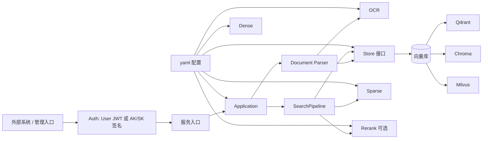
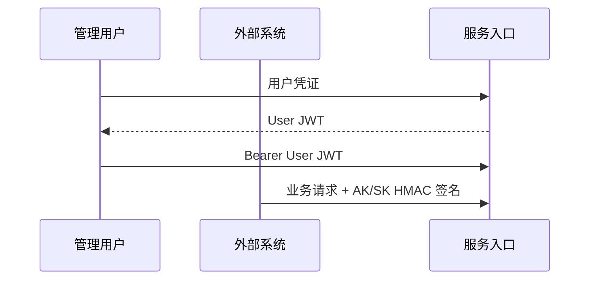
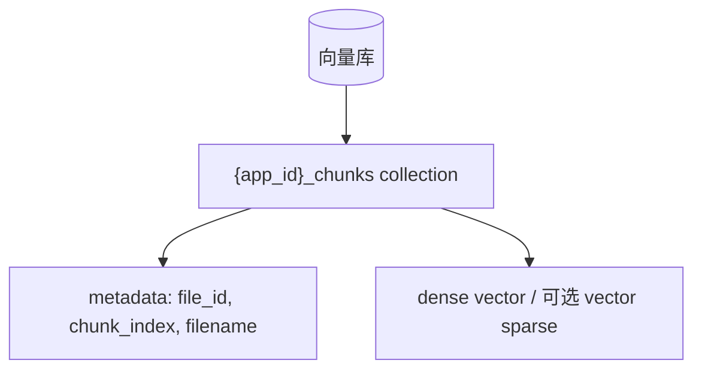
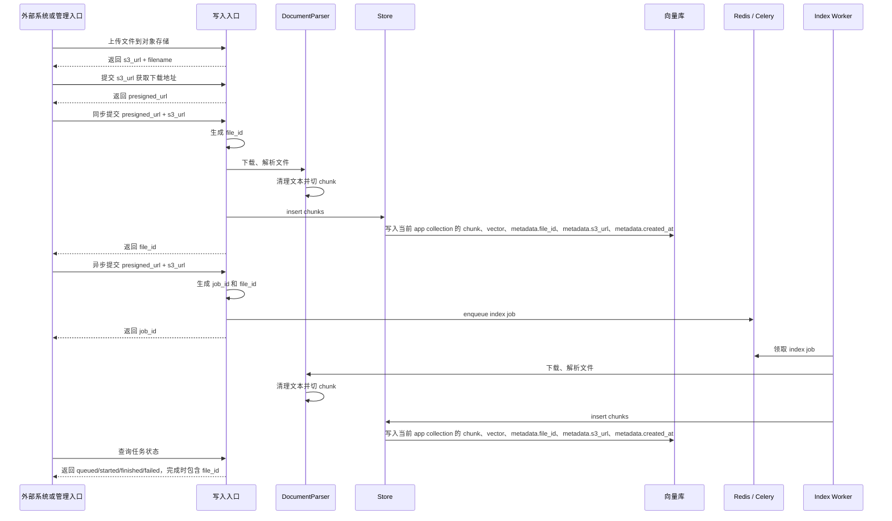

# 知识检索后端架构

本文说明知识检索后端的目标架构。系统以文件为父对象，以 chunk 为检索对象，外部系统通过 `file_id` 限定搜索范围。

架构目标是：向量库、dense 模型、sparse 检索、rerank 模型都通过 yaml profile 声明。服务入口和搜索流程只依赖稳定能力接口，不把某个模型、向量库或部署环境写死到业务逻辑里。

---

## 1. 架构目标

- 外部契约保持稳定，调用方不需要知道底层使用哪种向量库或模型。
- 向量库可通过 Store profile 切换。
- dense 能力可通过 Dense profile 切换。
- sparse 能力可通过 Sparse profile 切换。
- rerank 能力可通过 Rerank profile 切换。
- 每个外部系统使用独立 chunks collection，collection 名由 `app_id` 统一生成。
- 支持通过多个 `file_id` 限定搜索范围。
- 支持 dense、sparse、hybrid 三种检索模式。
- 支持可选 rerank。
- 启动时通过配置文件决定使用哪套组合。
- 应用层统一鉴权：管理用户使用 User JWT；外部系统业务请求直接使用 AK/SK HMAC 签名。
- 代码和配置使用通用命名，不绑定具体业务。

---

## 2. 核心概念

| 概念 | 含义 |
|---|---|
| `file_id` | 文件主键，外部系统保存后用于限定搜索范围 |
| file | 上传或对象存储索引的文件父对象，文件级信息从 chunk metadata 聚合得到 |
| chunk | 文件切片后的检索对象，存储在向量库 collection |
| `top_k` | 最多返回条数 |
| `fetch_k` | rerank 候选池大小，只在 `rerank=true` 时使用 |
| dense | 语义向量检索 |
| sparse | 关键词、词权重或稀疏向量检索 |
| hybrid | dense 和 sparse 的融合检索 |
| User JWT | 管理用户登录后得到的 JWT，用于管理功能 |
| `app_id` | 外部系统身份标识，用于鉴权、审计和 collection 隔离 |

查询范围示例：

```json
{
  "file_ids": ["<file_id>"]
}
```

`file_ids` 不传时搜索当前应用的整个 collection；传空数组会被拒绝；一次最多允许 1000 个 `file_id`。`file_id` 在当前应用的 collection 内使用；上游可以传入 UUID 作为 `file_id`，不传时由 RAG 生成。

### 2.1 总体架构图



这张图表达的是依赖方向：服务入口不直接绑定某个向量库或模型，搜索流程只依赖 `Store`、`Sparse`、`Rerank` 这些能力接口。实际使用的向量库和模型由 yaml profile 决定。

### 2.2 鉴权架构

系统在应用层区分管理用户和外部系统调用。管理用户登录后使用 User JWT；外部系统业务请求使用 AK/SK HMAC 签名。



管理用户使用用户名和密码换取 User JWT。外部系统使用 `app_id + access_key + secret_key` 对每个业务请求签名，业务入口直接验 access_key/secret_key 和签名。

外部系统签名串固定为 5 行：

```text
METHOD
PATH
TIMESTAMP
BODY_SHA256
APP_ID
```

`PATH` 只使用 URL path，不包含 query string。`signature = hex(hmac_sha256(secret_key, string_to_sign))`。`X-Timestamp` 参与签名，并限制允许的时间偏差；是否启用 nonce 由安全等级决定。

AK/SK 面向外部系统调用，User JWT 面向管理用户。AK/SK 签名里的 `app_id` 决定本次请求访问哪个 chunks collection。`file_id` 写入当前 app collection 的 chunk metadata。

服务入口完成鉴权后，会把请求身份归一成内部身份对象：

```text
admin -> 管理台用户，不绑定 app_id
app   -> 外部系统，绑定 AK/SK 签名里的 app_id
```

业务入口只使用归一后的身份对象判断数据范围。外部系统不能通过请求体切换 `app_id`；管理台用户调用索引、搜索、文件列表或向量数据接口时，需要显式选择 `app_id`，服务端再把它归一成当前请求的数据范围。

### 2.2.1 应用凭证和数据库初始化

外部系统身份由管理台创建。创建 app 时，后端只生成 `access_key` 和 `secret_key`，不创建、不删除、不重建向量库 collection。

```text
collection = {app_id}_chunks
```

应用凭证保存在 App Registry 文件中，路径由配置项 `auth.registry_file` 指定；未指定时使用项目根目录下的 `data/apps.json`。该文件是运行时数据，不进入 git。

数据库初始化属于数据库管理能力，由管理台在数据库页面显式触发。索引入口不会自动创建 collection；当前 app 尚未初始化数据库时，索引请求返回 `app database is not initialized`。删除 app 只删除 AK/SK 凭证，不删除该 app 的历史向量数据。

业务接口不允许调用方传入 collection 名，也不允许外部系统自行建表。外部系统只保存管理台分配的 `app_id`、`access_key`、`secret_key`。后续索引、查询、删除都根据 AK/SK 签名里的 `app_id` 自动进入对应 collection。

### LangChain 和原生 SDK 边界

LangChain 在系统里负责文档解析复用、文本切分、HuggingFace embedding 封装、Runnable 搜索编排和 Retriever 生命周期事件。开启 LangSmith 后，可以看到搜索请求在 `prepare_plan`、dense/sparse retriever、fusion、dedupe、rerank、format_response 等阶段的链路。

向量库读写和检索由 Store 层直接使用各向量库原生 SDK：

| 向量库 | Store 实现 | 原生依赖 | 职责 |
|---|---|---|---|
| Qdrant | `store.qdrant.QdrantStore` | `qdrant-client` | collection 创建、payload index、dense/vector sparse 写入与查询 |
| Chroma local | `store.chroma.ChromaStore` | `chromadb` | 本地 collection、metadata filter、dense 写入与查询 |
| Milvus / Milvus Lite | `store.milvus.MilvusStore` | `pymilvus` / `milvus-lite` | schema、dense/sparse index、scalar index、写入与查询 |

这个边界保证搜索流程只依赖 `Store` 接口，不受第三方封装层的底层能力暴露范围影响。新增向量库时，只需要实现 `Store` 接口；如果该向量库支持 vector sparse，再补对应的 `sparse/*` 适配类。

### 2.3 数据库结构图



系统按 app 使用独立 chunks collection 存储 chunk。不引入文件父表时，文件列表从当前 app collection 的 chunk metadata 聚合得到。`file_id` 写入 chunk metadata，并在支持的向量库里建立过滤索引。

### 2.4 写入流程图



写入入口可以同步执行索引，也可以创建异步任务。两种入口都接收 `presigned_url + s3_url`，并允许外部系统传入 UUID 格式的 `file_id`；不传时由 RAG 生成。管理台本地上传链路先通过上传接口生成 `file_id` 并写入对象存储路径，再调用 `/api/index/jobs`，因此管理台异步索引必须传入上传阶段返回的 `file_id`。文件名默认可从对象存储地址推导，也允许调用方指定展示名。同步索引成功返回代表已经写入向量库。异步索引创建任务后立即返回 `job_id`，后台 `index-worker` 完成下载、解析、切分、embedding 并写入向量库。调用方用 `job_id` 查询任务状态；只有状态为 `finished` 后才能保证 `file_id` 在向量库里已经可查。同步入口和异步 worker 复用同一套索引执行逻辑。对象存储索引使用 `presigned_url` 做一次性下载，不把临时下载 URL 写入 chunk metadata；稳定的 `s3_url` 会写入 chunk metadata 用于追溯。文件和 chunk 的 `created_at` 在索引写入时生成并写入 chunk metadata；异步任务时间来自 Celery result backend 和 RAG 自维护的 job metadata。存储层统一保存 UTC 时间，对外返回前再转换成本机或容器时区。

异步索引任务使用 Celery + Redis 存储，Redis 开启 AOF 持久化。任务入队成功代表任务已被接受；worker 不在线时，任务留在 Redis 中等待消费；任务成功或失败后的状态记录按配置保留，正常重启后仍可查询。RAG 不假设所有上游系统都有自己的队列、限流和重试能力；内部队列是 RAG 服务的资源保护边界，用来削峰并控制 OCR、embedding 和向量库写入并发。异步任务状态包含处理中、成功和失败信息。异步入队前会检查单位时间提交数量和队列积压数量，超过限制时拒绝任务。实际索引并发由 Celery worker 并发数控制。每个 `app_id` 对应独立 collection，外部系统只要按 UUID 规约生成 `file_id`，就不会和其他 app 的同名文件发生跨系统冲突。

Docker 开发环境使用 MinIO 模拟 S3。MinIO 提供本地 bucket 和对象下载能力，服务入口可以在本地联调时根据 `s3_url` 生成后端可访问的短期下载地址。生产环境里，重签通常由业务系统或对象存储网关完成，RAG 仍只消费 `presigned_url + s3_url`。

### 2.5 查询流程图


查询只查当前调用身份对应 app 的 chunks collection。`file_ids` 作为 metadata filter 缩小候选范围；dense / sparse / hybrid 在同一个范围内检索。hybrid 统一为 dense 和 sparse 两路并发后在应用层做 RRF 融合；开启 rerank 时，再对候选结果做二次排序。

搜索入口返回业务搜索结果和本次搜索总耗时。搜索完成后，后端把链路信息写入内存 ring buffer，供诊断入口读取最近搜索请求的总耗时、结果数和阶段耗时。

### 2.6 运行监控

运行监控提供轻量系统状态快照，包括运行状态、组件状态、collection、索引配置和组件绑定信息。监控状态不读取 chunk，不做文件数或 chunk 数统计。搜索链路快照面向单次查询诊断。

真正会影响索引结构的配置，例如 store、dense、sparse、collection，不允许在运行监控里直接修改。查询级参数，例如 mode、top_k、fetch_k、dense_weight、sparse_weight、rerank 开关，继续随搜索请求传入。

监控能力按三类组织：

- 组件：Store、Redis、Dense、Sparse、Rerank、OCR 的状态和绑定模型。
- 索引：异步索引任务列表、状态、文件名、文件 ID、chunk 数、错误和时间。
- 链路：最近若干次搜索的总耗时和各阶段耗时。

组件状态统一为四态：`ready` 表示组件已加载完成，`loading` 表示启用但尚未 ready，`disabled` 表示配置未启用，`error` 表示启动或加载失败。Sparse 作为一个组件表达，显示运行 profile 绑定的 sparse 类型和模型。

模型切换属于配置管理能力，不属于运行监控能力。

向量数据查看能力直接分页读取向量库 chunk 数据，展示 chunk 主键、`file_id`、`s3_url`、`filename`、`chunk_index` 和完整 chunk 文本。管理台文件列表从 MinIO/S3 按 `uploads/{app_id}/` 前缀分页读取原始上传文件，文件 ID 来自对象路径 `uploads/{app_id}/{file_id}/{filename}`。管理台按 `file_id` 删除文件时同时删除向量库 chunks 和该 MinIO/S3 前缀下的对象；上游删除文件接口只删除向量库 chunks。

### 2.7 Celery 索引 Worker

异步索引由 Celery worker 消费。Celery 负责 broker 消费、任务状态、失败重试和 worker 进程管理；`IndexJobRepository` 维护业务侧 job 索引，用于按 app 查询最近任务快照和补充展示元数据。

| 边界 | 实现 |
|---|---|
| 入队 | `indexing.queue.enqueue_index_job()` 调用 Celery `send_task()`，producer retry 使用有界策略 |
| 消费 | `indexing.tasks.index_object_task` |
| broker | Redis，默认 `REDIS_URL` |
| result backend | Redis，默认 `REDIS_URL` |
| 业务 job 索引 | `IndexJobRepository`，复用进程内 Redis client |
| app 任务列表 | `IndexJobRepository` 写入 Redis ZSet：`rag:index:jobs:{queue}:app:{app_id}` |
| 全局任务列表 | `IndexJobRepository` 写入 Redis ZSet：`rag:index:jobs:{queue}:all` |
| 任务展示元数据 | `IndexJobRepository` 写入 Redis Hash：`rag:index:job:{queue}:{job_id}` |
| 任务事件推送 | worker 通过 Redis Pub/Sub channel `rag:index:events:{app_id}` 发布任务状态事件 |

Docker CPU Celery worker 使用 prefork pool，默认并发为 1：

```text
celery -A indexing.celery_app:celery_app worker \
  --pool=prefork \
  --concurrency=1 \
  --queues index \
  --loglevel=INFO
```

Docker GPU Celery worker 使用 `solo` pool，固定单实例并发 1：

```text
celery -A indexing.celery_app:celery_app worker \
  --pool=solo \
  --concurrency=1 \
  --queues index \
  --loglevel=INFO
```

Native Celery worker 使用 `solo` pool：

```text
celery -A indexing.celery_app:celery_app worker \
  --pool=solo \
  --concurrency=1 \
  --queues index \
  --loglevel=INFO
```

Docker CPU 使用 prefork 是常驻子进程模型，不是每个任务 fork 一次。worker 主进程只创建基础配置和日志，不加载模型、不建立 Redis/Qdrant/MinIO 连接。每个子进程启动后执行模型加载和连接初始化，后续任务复用该子进程内同一份 `Application`，不会每个任务重复加载模型。CPU 并发可以通过 `INDEX_WORKER_CONCURRENCY` 调整。

Docker GPU 不使用 prefork：CUDA、torch、onnxruntime 在 fork 子进程中初始化容易崩溃；即使 `concurrency=1`，prefork 模式也会 fork 出子进程执行任务。worker 子进程崩溃后 Celery 会拉起新子进程，导致模型反复加载，显存分配和释放都可能出问题。因此 GPU worker 固定使用 `solo` pool 单实例，模型在进程内加载一次并常驻，任务串行消费。GPU 并发扩展不通过 prefork 多进程共享单卡，而是按卡分配独立 worker（`CUDA_VISIBLE_DEVICES`）或采用模型服务化。

Native 使用 `solo` 避免 macOS 上 native 模型 runtime、OCR runtime、gRPC 或底层数值库在 fork 子进程中崩溃；任务在同一个 worker 进程内串行执行并复用同一份 `Application`。

#### 2.7.1 Application 两阶段启动

`Application` 拆为模型阶段和运行连接阶段：

```python
def load_models(self):
    dense.start()
    sparse.start()
    rerank.start()  # profile 启用时
    ocr.start()

def init_connections(self):
    store.start()
    search.start()

def start(self):
    load_models()
    init_connections()
```

`load_models()` 只负责模型、分词器和 OCR runtime；`init_connections()` 负责向量库连接、collection 检查和搜索 pipeline 运行绑定。Docker Celery worker 在子进程内按顺序执行 `load_models()` 和 `init_connections()`，避免 fork 前持有模型 runtime、Redis/Qdrant/MinIO fd 或第三方后台线程。Native Celery worker 在 solo 进程内按需执行同样的初始化流程。API 进程继续调用 `Application.start()`，保持一个兼容入口。

#### 2.7.2 任务状态与列表

任务创建时：

1. API 检查队列积压和速率限制。
2. 写入 `rag:index:job:{queue}:{job_id}`，保存 `app_id`、`file_id`、`filename`、`s3_url`、`created_at`。
3. 写入 app ZSet 和全局 ZSet。
4. 通过 Celery `send_task()` 入队。

任务状态查询通过 Celery `AsyncResult` 获取状态和结果，再合并 `IndexJobRepository` 里的展示元数据，返回给 `_index_job_record()`。状态映射：

| Celery 状态 | API 状态 |
|---|---|
| `PENDING` / `RECEIVED` / `RETRY` | `queued` |
| `STARTED` | `started` |
| `SUCCESS` | `finished` |
| `FAILURE` / `REVOKED` | `failed` |

任务列表只读取 `IndexJobRepository` 的 ZSet 最近记录，不扫描 Celery 内部结构。任务详情读取 Celery result backend。成功结果返回 `{"app_id", "file_id", "chunk_count"}`；失败错误读取 Celery traceback。`IndexJobRepository` 使用进程内 Redis client 复用，避免每次入队或查询都重新创建 Redis 客户端。

任务事件实时推送链路：worker 在任务开始、成功或失败时调用 `publish_index_job_event()`，向 Redis Pub/Sub channel `rag:index:events:{app_id}` 发布 `{"app_id", "job_id", "status", "filename"}` 事件；API 进程的 SSE 端点 `GET /api/index/jobs/stream` 订阅该 channel，把事件转发给管理台，管理台据此原位更新最近 200 条任务快照。worker 重试产生的中间状态不发事件，只发布 `started` / `finished` / `failed` 三种状态。事件发布失败（RedisError）时静默降级，不影响索引流程本身，管理台通过任务列表接口轮询兜底。

#### 2.7.3 重试与错误处理

任务执行异常时按 `INDEX_JOB_RETRY_MAX` 判断是否交给 Celery retry。业务不可恢复错误直接失败；临时基础设施异常可以重试。API 进程调用 `send_task()` 时使用有界 producer retry 策略，避免 broker 暂时不可用时无限阻塞请求线程；producer retry 次数和间隔由 `INDEX_ENQUEUE_MAX_RETRIES`、`INDEX_ENQUEUE_RETRY_INTERVAL_START`、`INDEX_ENQUEUE_RETRY_INTERVAL_STEP`、`INDEX_ENQUEUE_RETRY_INTERVAL_MAX` 控制。

| 错误 | 处理 |
|---|---|
| app database 未初始化 | 业务错误，直接失败 |
| 文件格式不支持 | 业务错误，直接失败 |
| Redis broker/backend 不可用 | Celery/redis client 负责重连；API 入队失败返回 503 |
| Qdrant/MinIO 临时不可用 | 任务重试，超过重试次数后失败 |
| 模型/OCR 运行异常 | 任务失败或按配置重试 |

任务超时使用三层防护：`task_soft_time_limit`（默认 `INDEX_JOB_TIMEOUT_SECONDS` 1800 秒）到点抛 `SoftTimeLimitExceeded`，任务捕获后按 `INDEX_JOB_RETRY_MAX` 决定重试或失败，正常 ack 不会触发消息重投；`task_time_limit`（软超时 + 300 秒）兜底杀死卡在原生调用（torch/OCR）的任务；`visibility_timeout`（`max(3600, 超时 * 2)`）大于执行窗口，避免正常执行中的任务被重新投递造成重复索引。

#### 2.7.4 限流与保留

入队限流仍在 API 进程执行：

- `INDEX_RATE_LIMIT_PER_MINUTE` 控制单位时间入队数量。
- `INDEX_MAX_PENDING_JOBS` 使用 Redis broker 中当前等待队列长度控制积压。
- `INDEX_JOB_RESULT_TTL_SECONDS` 和 `INDEX_JOB_FAILURE_TTL_SECONDS` 控制任务状态和列表索引保留时间。

任务列表 ZSet 的保留时间不参与 pending 判断，避免历史成功/失败任务影响新任务入队。

#### 2.7.5 进程生命周期

Docker Celery 主进程负责 fork 和监督 worker 子进程。主进程通过 `worker_init` 创建基础 `Application` 对象；子进程通过 `worker_process_init` 加载模型、初始化运行连接，并在后续任务中复用。Native solo worker 不 fork 子进程，任务在 worker 进程内直接执行。Docker GPU worker 同样使用 `solo` pool 单实例，模型在进程内加载一次并常驻；GPU 场景不启用 prefork。worker 退出、信号处理、崩溃重启、任务确认由 Celery 管理；Docker 和进程管理器负责容器级重启。

worker 与 API 进程各自常驻一份模型，这是当前部署约定。API 进程服务同步索引、搜索和管理台能力；worker 进程服务异步索引任务。两边各持有一份模型内存，换取进程职责清晰和故障隔离。后续如果内存成为瓶颈，再评估独立模型服务或只让 worker 持有模型、API 进程不预加载模型的形态。

---

## 3. 配置目录

后端使用 yaml profile 描述一套完整运行组合。配置读取代码和配置结构校验代码与具体 profile 解耦，运行时由环境选择一个 profile 启动。

每个运行 profile 使用一个 yaml 文件。yaml 文件固定一种索引结构，不在同一个文件里放多套 dense 或 vector sparse 候选。真正会影响索引结构的组件，例如 dense 和 vector sparse，必须通过切换 profile 或重建索引改变。不会改变索引结构的组件，例如 rerank、ocr，可以继续在同一个 yaml 里用候选项和 `enable` 表达。

每个组件都显式写 `import_path`。组件名负责表达“我要哪种能力”，`import_path` 负责表达“这类能力由哪个 Python 类实现”。这样配置文件里能直接看出实现位置，也方便以后把组件迁移成插件。

`bootstrap.py` 负责应用启动和关闭。`container.py` 负责按配置组装 dense、sparse、store、search、rerank、ocr。它们不保存具体业务规则，也不把某个模型或向量库写死到搜索逻辑里。

profile 名只作为运维识别入口；真正的索引结构以 yaml 里的 store、dense 和 sparse 配置为准。业务 collection 名不写在 yaml 里，由后端根据 `app_id` 统一生成。

---

## 4. 配置结构

profile 结构示例：

```yaml
dense:
  name: <dense_name>
  model_name: <dense_model>
  import_path: <dense_class>

sparse:
  type: <sparse_type>
  import_path: <sparse_class>

store:
  type: <store_type>
  import_path: <store_class>

search:
  default_mode: <dense|sparse|hybrid>
  top_k: <max_results>
  fetch_k: <rerank_candidates>
  dense_weight: <hybrid_dense_weight>
  sparse_weight: <hybrid_sparse_weight>
  rrf_k: <rrf_constant>

logging:
  level: <log_level>
  search_trace: <true|false>

rerank:
  <rerank_name>:
    enable: <true|false>
    model_name: <rerank_model>
    import_path: <rerank_class>

ocr:
  <ocr_name>:
    enable: <true|false>
    model_name: <ocr_model>
    import_path: <ocr_class>
```

不同向量库的连接字段不强行统一。统一的是 `store` 暴露给 `search` 的能力。

同一个 profile 只声明一种 store 和一种 sparse 后端。运行形态不同、索引结构不同或模型组合不同，都应该拆成不同 profile，不在同一个 yaml 里用 `enable` 切换会改变索引结构的组件。

Milvus 的索引策略按运行形态区分：

- Milvus store 使用 `pymilvus.MilvusClient` 创建 schema、索引、写入和查询。
- Standalone 和 Lite 使用不同索引策略，由 Store 实现按运行形态选择。
- sparse 索引按 sparse 类型选择对应的 Milvus sparse index 和 metric。
- `file_id` 是过滤字段，创建 collection 时会额外建 scalar index。

---

## 5. 模块目录

目录按职责分层：

```text
backend/
  main.py
  bootstrap.py
  container.py
  loader.py
  schema.py
  config/
  dense/
  sparse/
  store/
  search/
  rerank/
  ocr/
  tokenizer/
```

模块职责：

| 模块 | 职责 |
|---|---|
| `main.py` | FastAPI 应用、鉴权、写入、搜索、删除、列表和配置入口 |
| `bootstrap.py` | 创建 Application，管理组件启动和关闭 |
| `container.py` | DI 容器，按配置组装组件并注入依赖 |
| `config.py` | 应用配置入口，暴露搜索参数、模型路径、向量库配置 |
| `device.py` | 检测当前可用计算设备；有 GPU 时优先使用 GPU，否则使用 CPU |
| `download_models.py` | 下载或准备本地模型目录 |
| `loader.py` | 读取运行环境指定的 yaml profile |
| `schema.py` | 校验配置结构和默认值 |
| `document_parser.py` | 文件解析、OCR 调用、文本清理、chunk 生成 |
| `dense/` | 生成 dense 向量 |
| `sparse/` | 执行应用内 sparse 检索，或生成 sparse vector |
| `store/` | 连接向量库，负责写入、删除、列表、dense 查询、可选 sparse 查询 |
| `search/` | SearchPipeline 和 SearchRunner，负责检索流程、并发查询、去重、融合和 rerank 调用 |
| `rerank/` | 对候选结果做二次排序 |
| `ocr/` | 图片或 PDF 内图片的 OCR |
| `tokenizer/` | 分词能力接口和 jieba 实现 |

命名规则：

- `dense/` 只负责 dense vector。
- dense 能力接口命名为 `Dense`。
- HuggingFace dense 实现命名为 `HuggingFaceDense`。
- dense 模型通过 yaml 的 `model_name` 指定，启动时解析到 `models/` 下的实际路径。
- 复用模型能力放在共享模块里，向量库 sparse 适配按 Store 拆开，不放在 `dense/` 里。

---

## 6. 组件组装

启动目标流程：

```text
1. 读取运行环境指定的配置 profile
2. 解析 yaml
3. 校验配置
4. 创建 DI 容器
5. 容器按配置创建 dense、sparse、store、search、rerank、ocr
6. FastAPI 进程启动
7. 后台初始化线程按顺序启动 Application 组件
8. 初始化成功后 application.ready=true
```

示意代码：

```python
config = load_app_config()
container = create_container(config)

dense = container.dense()
sparse = container.sparse()
store = container.store(dense=dense, sparse=sparse)
search = container.search(store=store, sparse=sparse)
rerank = container.rerank()
ocr = container.ocr()
```

`container.py` 使用 DI 容器组装组件。配置里的组件名映射到容器 provider，provider 负责创建实现并注入依赖。`bootstrap.py` 只管理 Application 生命周期。FastAPI 启动后由后台线程初始化 Application；如果数据库暂时不可用，后端进程不退出，后台线程按退避间隔继续重试。搜索流程只依赖组件能力，不直接依赖实现类。

`Application` 使用两阶段启动：`load_models()` 启动 dense、sparse、rerank、ocr；`init_connections()` 启动 store、search。`Application.start()` 是兼容入口，顺序等同于先加载模型再初始化运行连接。其中 `rerank` 只有在 profile 启用时才启动。`Application.stop()` 按反向顺序停止组件。

Store 和 Search 不负责偷偷启动 dense 或 sparse，只校验依赖组件已经 ready。这样初始化和查询严格分离：模型只在启动阶段加载，查询阶段不会懒加载模型。启动某个组件失败时，`Application` 会记录对应的 `component_errors`，监控状态把组件标成 `error`。

---

## 7. Store 能力

`store/base.py` 定义搜索流程需要的统一能力。不同向量库的连接方式可以不同，但对 `search` 暴露的方法保持一致。

目标能力：

```python
class Store:
    def start(self) -> None: ...
    def stop(self) -> None: ...

    def add_file_chunks(self, chunks: list[dict], file_id: str) -> int: ...
    def delete_file_chunks(self, file_id: str) -> int: ...

    def get_total_chunks(self, file_ids: list[str] | None = None) -> int: ...
    def get_search_documents(self, metadata_filter: object) -> list[dict]: ...
    def build_file_filter(self, file_ids: list[str] | None = None): ...
    def search_dense(self, query: str, limit: int, metadata_filter: object) -> list[dict]: ...
    def search_sparse(self, query: str, limit: int, metadata_filter: object) -> list[dict]: ...
    def search_hybrid(
        self,
        query: str,
        limit: int,
        metadata_filter: object,
        dense_weight: float,
        sparse_weight: float,
        rrf_k: int,
    ) -> list[dict]: ...
    def sparse_uses_store(self, sparse: object | None = None) -> bool: ...
```

`SearchPipeline` 只依赖 `Store` 接口，不直接依赖 `store.qdrant`、`store.chroma`、全局 store 模块函数或向量库 SDK。各 Store 实现内部使用原生 SDK 完成 collection、索引、写入、删除、列表和查询。`bm25` sparse 使用 `get_search_documents()` 取文本，再交给 `sparse/bm25.py` 排序；`bge_m3` sparse 只用于支持稀疏向量的 store，由对应向量库执行 sparse 查询。

写入规则：

- 每次索引生成一个新的全局 `file_id`。
- 更新文件等价于删除旧 `file_id` 后重新索引。
- `file_id`、`chunk_index`、`filename` 必须写入 chunk metadata。
- 不同 `file_id` 的写入可以并发。
- 读操作可以并发。

---

## 8. Sparse 能力

每个 profile 只配置一个 `sparse` 后端。`sparse` 属于索引结构的一部分，不做运行时切换；要切换 sparse 类型，需要使用对应 profile 和对应 collection。搜索流程里统一表现为 Sparse Retriever，但内部有两种路线：

```text
应用内 Sparse Retriever
  -> 先从 store 取候选文本
  -> 应用内 `bm25` sparse 使用 `tokenizer=jieba` 打分

Vector Sparse Retriever
  -> 查询向量库 sparse vector / 内置 sparse 能力
```

这两种都属于检索节点，都会放在 SearchPipeline 的 Retriever 位置；区别只是 sparse 分数在哪里计算。
benchmark 报告中的 `sparse_impl` 使用 `app` 和 `vector` 区分这两条路线。

配置读取结果包含 profile 固定使用的 sparse 后端：

```json
{
  "sparse": {
    "name": "<sparse_name>",
    "tokenizer": "<tokenizer>"
  }
}
```

`bm25` sparse：

```yaml
sparse:
  type: <sparse_type>
  tokenizer: <tokenizer>
```

流程：

```text
1. store 按 file_ids 过滤后取候选文本
2. sparse 在应用内分词和打分
3. 返回排序后的结果
```

应用内 BM25 sparse 流程：

```text
1. tokenizer 对查询和候选文本分词
2. 去掉纯标点和单个汉字这类不稳定命中项
3. BM25 对候选文本打分排序
4. 不返回零命中文本
```

应用内 `bm25` sparse 直接使用 `rank_bm25` 计算分数，不使用 LangChain `BM25Retriever.invoke()`。原因是 `BM25Retriever.invoke()` 只返回 `Document` 列表，不直接返回 BM25 分数；搜索流程需要分数做过滤、排序和 hybrid 融合。

向量库检索和应用内 BM25 的 score 来源不同：

```text
dense 检索
  -> 使用各向量库 store 的原生查询接口
  -> score 来自向量库

vector sparse
  -> 使用向量库 sparse 查询
  -> score 来自向量库

应用内 bm25 sparse
  -> 使用 rank_bm25 在应用进程里计算
  -> score 来自 BM25 关键词打分
```

模型型 vector sparse 流程：

```text
1. 上传时 sparse 生成 sparse vector
2. store 把 sparse vector 写入向量库
3. 查询时 sparse 生成 query sparse vector
4. store 执行 sparse vector 查询
```

向量库内置 sparse 流程：

```text
1. 上传时按向量库 analyzer 从文本生成 sparse 索引数据
2. 查询时向量库对查询文本执行同一套 analyzer
3. sparse 由向量库执行；hybrid 仍由 SearchPipeline 对 dense 和 sparse 结果做应用层融合
```

这个设计可以兼容：

```text
任意 Store + 应用内 sparse
支持 sparse vector 的 Store + 模型型 vector sparse
支持内置 sparse 的 Store + 向量库内置 sparse
```

---

## 9. 知识集合

系统对每个 app 使用一个知识集合：

| 集合 | 用途 |
|---|---|
| `{app_id}_chunks` | 存储当前 app 的所有文件 chunk |

collection 名由后端根据 `app_id` 生成。文件范围通过 `file_id` metadata filter 表达；不同 app 的数据落在不同 collection。不同模型组合如果索引结构不兼容，必须使用不同 profile 或重建对应 app collection，避免新旧向量混在一个索引里。

---

## 10. Payload Metadata

每条 chunk 在向量库里分成三类数据：

| 类型 | 存什么 | 例子 |
|---|---|---|
| 正文内容 | 被检索、展示的 chunk 文本 | `content` / `documents` / `text` |
| metadata | 描述这段正文的附加信息 | `file_id`、`filename`、`chunk_index`、`s3_url` |
| vector | 正文内容生成出来的向量 | dense vector、可选 sparse vector |

chunk metadata：

```json
{
  "file_id": "<file_id>",
  "filename": "<filename>",
  "chunk_index": 0,
  "s3_url": "<s3_url>"
}
```

字段约定：

| 字段 | 类型 | 说明 |
|---|---|---|
| `file_id` | keyword/string | 必填，搜索过滤用，要建索引 |
| `filename` | keyword/string | 必填，搜索结果展示用 |
| `chunk_index` | integer | 必填，文件内 chunk 序号，不建索引 |
| `s3_url` | string | 对象存储来源地址，用于追溯，不建索引 |

放进 metadata 不等于自动有高效过滤索引。只给 `file_id` 建过滤索引：

| 向量库 | `file_id` 过滤索引策略 |
|---|---|
| Qdrant | 创建 payload index：`metadata.file_id` |
| Milvus | 创建 scalar index：`file_id` 字段 |
| Chroma local | metadata 写入后由 Chroma 本地 SQLite metadata 表维护索引；代码不额外声明索引 |

`filename`、`chunk_index` 会随每条 chunk 一起保存，搜索结果可以返回这些字段；它们不作为搜索过滤条件，不建索引。

chunk 文本会随分块一起写入向量库。不同向量库的原生字段不同，但 Store 对搜索流程统一返回 `content`：

| 向量库 | 原生保存位置 | Store 返回字段 |
|---|---|---|
| Qdrant | payload 的 `content` | `content` |
| Chroma local | Chroma collection 的 `documents` | `content` |
| Milvus / Milvus Lite | scalar 字段 `text` | `content` |

向量库里保存的是解析后的 chunk 文本，不保存完整原始文件内容。上传接口把原文件写入对象存储；对象存储索引接口不保存 `presigned_url`。

---

## 11. 内容存储边界

系统默认使用 `vector` 内容存储形态：chunk 正文随向量一起写入向量库。Qdrant 使用 payload `content`，Chroma 使用 `documents`，Milvus 使用 scalar 字段 `text`。这种形态适合轻量部署，少一个事实数据库，文件列表和删除能力都从 chunk metadata 聚合得到。

系统保留 `postgres` 内容存储形态作为可选架构：Postgres 做文件和 chunk 的事实表，向量库只做检索索引。该形态适合需要文件状态、精确统计、审计、复杂管理查询或大规模数据治理的部署。

两种内容存储形态的数据职责：

| 数据 | `vector` 形态 | `postgres` 形态 |
|---|---|---|
| chunk 正文 | 向量库 | Postgres |
| dense vector | 向量库 | 向量库 |
| vector sparse | 向量库 | 向量库 |
| `file_id` 过滤字段 | 向量库 metadata/scalar | 向量库 metadata/scalar + Postgres |
| `chunk_id` | 向量库主键 | Postgres 主键 + 向量库引用 |
| 文件列表 | 从向量库 metadata 聚合 | 从 Postgres 查询 |
| 文件状态 | 不保存 | Postgres |

`postgres` 形态的最小事实表：

```sql
create table files (
  id text primary key,
  filename text not null,
  s3_url text,
  status text not null
);

create table chunks (
  id text primary key,
  file_id text not null references files(id),
  chunk_index integer not null,
  content text not null
);
```

`postgres` 形态下，写入流程由 ContentStore 和 VectorStore 共同完成：

```text
1. 写入入口接收 presigned_url + s3_url
2. RAG 生成 file_id
3. DocumentParser 解析、OCR、切 chunk
4. ContentStore 写入 files 和 chunks
5. VectorStore 写入 chunk_id、file_id、chunk_index 和 vector
6. 写入入口返回 file_id 或异步任务状态
```

查询流程：

```text
1. VectorStore 按 query + file_id filter 搜索
2. VectorStore 返回 chunk_id、file_id、chunk_index、score
3. ContentStore 按 chunk_id 批量读取 content 和文件信息
4. SearchPipeline 合并 score、content、metadata
5. rerank 和 format_response 使用合并后的结果
```

`vector` 和 `postgres` 两种形态不能直接切配置复用同一份旧数据。切换内容存储形态时，必须迁移 chunk 正文和索引引用，或重新索引原始文件，保证 `chunk_id`、`file_id` 和正文来源一致。

---

## 12. 文档解析与切片

上传文件先解析成纯文本，再切成 chunk 写入 store。

切片参数由配置决定：

| 参数 | 含义 |
|---|---|
| chunk size | 单个 chunk 的目标长度 |
| overlap | 相邻 chunk 的重叠长度 |

切片按中文文档常见边界拆分，优先使用段落、换行、中文句号、感叹号、问号、分号、逗号和空格。

解析后的文本会做 Unicode 归一化，并去掉中文字符之间由 PDF 提取产生的多余空格。

---

## 13. 搜索计划

`SearchPlan` 描述一次搜索：

```python
SearchPlan(
    query="查询内容",
    mode="hybrid",
    top_k=max_results,
    rerank=False,
    fetch_k=rerank_candidates,
    dense_weight=hybrid_dense_weight,
    sparse_weight=hybrid_sparse_weight,
    rrf_k=rrf_constant,
    file_ids=["<file_id>"],
)
```

字段说明：

| 字段 | 说明 |
|---|---|
| `query` | 查询文本 |
| `mode` | `dense` / `sparse` / `hybrid` |
| `top_k` | 最多返回条数 |
| `rerank` | 是否使用 rerank |
| `fetch_k` | rerank 候选池大小 |
| `dense_weight` | 本次 hybrid 查询的 dense 权重 |
| `sparse_weight` | 本次 hybrid 查询的 sparse 权重 |
| `rrf_k` | 本次 hybrid 查询的 RRF 参数 |
| `file_ids` | 查询文件范围；不传时搜索当前 app collection |

---

## 14. 搜索执行

检索阶段数量：

```text
rerank=false -> retrieve_limit = top_k
rerank=true  -> retrieve_limit = fetch_k
```

执行流程：

```text
1. 检查 application 已 ready
2. SearchPlan 进入 SearchPipeline Runnable
3. prepare_plan 计算 retrieve_limit
4. retrieve 按当前调用身份的 app_id 选择 collection，并按 file_ids 构造 metadata_filter
5. hybrid 时 dense / sparse 使用 RunnableParallel 并发查询
6. fusion 对 dense / sparse 结果做加权倒数排名融合
7. dedupe 按 chunk id 去重
8. rerank=true 时，对合并候选执行 rerank
9. format_response 最多返回 top_k 条
```

Runnable 结构：

```text
SearchPipeline RunnableSequence
  prepare_plan
  retrieve
    dense/sparse Retriever RunnableParallel
    fusion
  dedupe
  rerank
  format_response
```

dense 和 sparse 检索节点使用 LangChain `BaseRetriever`。这些节点会触发 LangChain retriever 生命周期事件，开启 LangSmith 后会显示为 retriever run。`prepare_plan`、`fusion`、`dedupe`、`rerank`、`format_response` 不是检索动作，继续使用普通 Runnable 阶段。

三种检索模式：

```text
dense  -> Dense Retriever 调用 Store.search_dense()，由具体 store 实现 dense 查询
sparse -> 应用内 Sparse Retriever 执行 BM25，或 Vector Sparse Retriever 调用向量库 sparse 查询
hybrid -> dense + sparse 并发后应用层 RRF 融合；sparse 可以是应用内 BM25，也可以是向量库 sparse
```

并发规则：

- hybrid 内部 dense 和 sparse 可以并发查询。
- rerank 在候选合并去重后执行。

排序规则：

- dense 按向量库返回的 dense 相似度排序。
- sparse 按 sparse 自身分数排序。
- hybrid 按加权倒数排名融合排序。
- rerank 开启时，最终顺序由 rerank 决定。

`top_k` 是最多返回条数，不是必须填满。sparse 不补满，查不到就可以返回空；dense 和 hybrid 如果不做额外相关性判断，本质上都是 top_k 排序，在库里有足够文档时可能返回到 `top_k` 条，不保证结果真的相关。

`rrf_k` 是 hybrid 的 RRF 融合参数，用于计算 dense/sparse 融合分。它不是返回条数，也不是候选池大小。

---

## 15. 日志

日志配置跟随业务 yaml：

```yaml
logging:
  level: <log_level>
  max_bytes: <max_bytes>
  backup_count: <backup_count>
  search_trace: <true|false>
```

默认只输出到 stdout，不写本地文件。如果配置 `file`，则同时写 stdout 和本地滚动文件：

```yaml
logging:
  level: <log_level>
  file: <log_file>
  max_bytes: <max_bytes>
  backup_count: <backup_count>
  search_trace: <true|false>
```

日志格式统一是 JSONL，一行一条 JSON。普通应用日志和搜索链路日志使用同一个格式，通过 `logger` 和 `event` 区分：

```json
{"logger":"rag.app","event":"startup_ready","message":"Startup model preload done"}
{"logger":"rag.trace","event":"search_trace","query":"查询内容","mode":"hybrid","elapsed_ms":123.4}
```

`rag.app` 记录启动、关闭、模型加载、OCR 加载、上传、删除、异常等应用事件。`rag.trace` 记录一次搜索的链路信息，包括查询参数、总耗时、结果数量和阶段耗时。`search_trace: false` 时不输出搜索链路日志。

后端同时维护一份内存日志 ring buffer，保存最近运行日志。SSE 日志流在连接建立后先输出最近日志，再持续输出实时运行日志。运行日志和搜索 trace 共享 JSONL 日志格式，但读取入口不同。

Docker 模式下，应用仍输出 JSONL 到 stdout。Docker Compose 使用 `json-file` driver 按大小滚动容器日志，避免日志无限增长。

LangSmith 和本地 JSONL 日志可以同时开启。LangSmith 用于查看 LangChain Runnable / Retriever 的可视化链路；JSONL 日志是本地和生产环境都能保留的基础日志。

---

## 16. 多模型扩展

新模型作为新的 profile 接入，不替换既有 profile。dense、sparse、rerank 分别通过各自接口扩展，Store 只关心向量维度、字段结构、索引类型和过滤能力是否匹配。

索引规则：

- 不在同一个 collection 里混用不同 dense 向量维度。
- 不在 dense-only collection 里直接写入 vector sparse。
- 代码不会在启动时阻止使用已有 app collection；切换模型、sparse 类型或向量库结构后，由配置和 app collection 重建流程保证索引不混用。
- 测试用例使用测试 collection 或临时目录，不复用生产 collection。

---

## 17. 部署

后端启动只依赖一个配置入口：

```text
CONFIG_FILE=/path/to/config.yaml
```

生产环境要求：

- 向量库使用独立持久化存储。
- 模型文件保存在固定路径。
- 配置文件由部署环境指定。
- 健康检查表示后端进程存活；就绪检查表示 RAG 组件和向量库已初始化完成。
- 该设计对应 Kubernetes 的 liveness/readiness 模式：健康检查可作为 liveness probe，就绪检查可作为 readiness probe。
- RAG 未 ready 时，写入、查询、文档列表等业务入口返回 503；后台初始化成功后自动恢复。
- LangSmith tracing 由部署环境通过 `LANGSMITH_TRACING`、`LANGSMITH_API_KEY`、`LANGSMITH_PROJECT` 控制，不写入 yaml。
- 不同检索组合需要使用不同 profile，并重建对应 app collection 或 index。
- Qdrant、Chroma、Milvus 等具体服务按各自方式部署；服务型数据库和嵌入式文件库的部署边界要分开处理。
- 同名文件替换使用 document key 细粒度锁或按 document key 分区的写入队列。
- 向量库数据目录需要独立备份。

Docker 开发模式按计算资源拆分运行入口。GPU 声明使用 Docker Compose device reservation 写法：

```yaml
deploy:
  resources:
    reservations:
      devices:
        - driver: nvidia
          count: all
          capabilities: [gpu]
```

GPU profile 的 index worker 使用 `solo` pool 单实例，不使用 prefork；原因和并发扩展方向见 2.7。

Docker Compose 默认设置 `TZ=Asia/Shanghai`，对外展示时间和日志时间会按该时区输出。存储层仍保存 UTC 时间；部署到其他时区时通过外部 `TZ` 环境变量覆盖展示时区。

数据目录按数据库产品分组。服务型数据库由独立进程持有数据目录；嵌入式文件库由后端进程直接读写，不要同时启动多个后端访问同一份嵌入式库文件。
